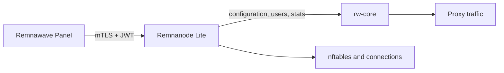

<div align="center">

# Remnanode Lite

**A lightweight Remnawave Node implementation in Go for small Linux servers**

[English](README.md) | [简体中文](README.zh-CN.md) | [Русский](README.ru.md)

[](https://github.com/luxiaba/remnanode-lite/actions/workflows/ci.yml)
[](https://github.com/luxiaba/remnanode-lite/actions/workflows/container.yml)
[](https://github.com/luxiaba/remnanode-lite/actions/workflows/security.yml)
[](go.mod)
[](LICENSE)

[Docker quick start](#docker-quick-start) · [Native Linux](#native-linux) · [Configuration](docs/configuration.md) · [Operations](docs/operations.md) · [Documentation](docs/README.md)

</div>

Remnanode Lite runs a Remnawave-compatible Node on Linux. It receives configuration from Remnawave Panel, supervises rw-core, manages users and plugin rules, and reports system and traffic statistics. Each Docker image includes the exact rw-core and runtime data selected for that release; published Native lifecycle bundles use the same release-selected assets.

The maintained deployment profile is designed for a server with **512 MiB RAM, 1 vCPU, and 2 GB of disk**. Images are available for both `linux/amd64` and `linux/arm64`.

> [!NOTE]
> Remnanode Lite is an independent community project. It is not affiliated with or endorsed by Remnawave. Compatibility follows the public behavior of the official Node, while this codebase is developed and maintained independently.

## Highlights

- Implements the Remnawave Node `2.8.0` API contract.
- Runs the Node as one Go process that directly manages rw-core, without Node.js or s6.
- Uses Docker Compose as the simplest deployment path, with a self-contained Native Linux option for hosts that cannot run Docker.
- Includes the same maintained low-memory profile for container and Native services on 512 MiB servers.
- Supports live user updates, statistics, connection management, and the official plugin rule formats.
- Publishes multi-architecture images to GHCR with SBOM, provenance, and build attestations.
- Native Linux support provides transactional install, upgrade, rollback, and repair through `rnlctl`.
- Uses one Compose file for Docker deployment. No source tree or persistent data volume is required, and `.env` remains optional.

## Choose a deployment mode

| | Docker Compose | Native Linux |
| --- | --- | --- |
| Choose it when | Docker Engine with Compose v2 is already available. This is the default path. | Docker cannot be installed, or its daemon and container-runtime overhead are not appropriate for the host. |
| Installation | Download the Release Compose asset and set the Panel Secret in `.env` or an intentional inline mapping. | Download one exact Release, verify `install.sh`, and run the installer as root. |
| Update and rollback | Select an exact image tag or digest, then pull and recreate the container; restore the previous image reference to roll back. | Use `rnlctl upgrade --to VERSION` and `rnlctl rollback`; one verified previous generation is retained. |
| Host service | Requires the Docker Engine daemon and its container runtime. | Does not require the Docker Engine daemon or a container runtime, but `remnanode-lite` still runs as a systemd or OpenRC background service. |
| Version reference | Exact tag or manifest digest is recommended; moving `latest` and `preview` are opt-in channels. | Exact `X.Y.Z` or `X.Y.Z-rnl.N` Releases only; moving image channels are never resolved. |

Both paths use host networking and require `NET_ADMIN`. Do not run them beside another Node that uses the same Panel or proxy ports.

## Docker quick start

You need Docker Engine with Compose v2, a Node created in Remnawave Panel, and the complete Secret Key for that Node. The port must be reachable from the Panel. Commands below assume a root shell; use `sudo` where needed.

Download the Compose file and environment template from one exact stable Release:

```bash
mkdir -p /opt/remnanode-lite
cd /opt/remnanode-lite

VERSION=2.8.0
BASE="https://github.com/luxiaba/remnanode-lite/releases/download/v${VERSION}"

curl -fL \
  "${BASE}/docker-compose.single-file.yaml" \
  -o docker-compose.yaml
curl -fL \
  "${BASE}/remnanode-lite.env.example" \
  -o .env

chmod 600 docker-compose.yaml .env
```

The Compose CLI automatically reads `.env` from this directory. Both downloaded files select the exact image version from that Release. Set the Node port and complete Secret from the Panel in `.env`:

```env
NODE_PORT=38329
SECRET_KEY=PASTE_THE_COMPLETE_PANEL_SECRET_KEY
```

The Compose fallback for `NODE_PORT` is `2222`; `38329` is only an example. Whichever port you use must match the Node port configured in the Panel.

Existing deployments may keep their current custom directory; changing the directory name is not required for an upgrade.

To keep a literal single-file deployment without `.env`, replace the `SECRET_KEY` interpolation in `docker-compose.yaml` with the complete value directly. The following example also changes the port fallback to `38329`:

```yaml
environment:
  NODE_PORT: "${NODE_PORT:-38329}"
  SECRET_KEY: "PASTE_THE_COMPLETE_PANEL_SECRET_KEY"
```

Start the Node:

```bash
cd /opt/remnanode-lite
docker compose config --quiet
docker compose pull
docker compose up -d --no-build
docker compose ps
docker compose logs --tail=100 remnanode-lite
```

The container should become healthy, then the Node should return online in the Panel. Confirm the deployment with real proxy traffic. Container health alone does not check Panel connectivity or rw-core traffic.

The official container's `NODE_PORT` and `SECRET_KEY` can be reused when migrating. Stop the old container before starting this one. The [Docker deployment guide](docs/deployment-docker.md) covers migration, exact-version installs, digest pinning, and rollback.

## Native Linux

Use the Native bundle when Docker cannot be installed or the Docker Engine daemon and container runtime are not appropriate for the host. Native does not mean that the Node has no background service: `remnanode-lite` runs directly under systemd or OpenRC. Rocky Linux 9 with systemd is the primary target; Rocky Linux 8 and Debian 12 are compatible. OpenRC support is experimental and requires a working cgroup v2 setup.

Native installs never follow a moving channel. Download `install.sh` and
`SHA256SUMS` from the same exact GitHub Release, verify the installer, and name
the release explicitly:

```bash
VERSION=2.8.0
BASE="https://github.com/luxiaba/remnanode-lite/releases/download/v${VERSION}"

curl -fLO "${BASE}/install.sh"
curl -fLO "${BASE}/SHA256SUMS"
grep '  install.sh$' SHA256SUMS | sha256sum --check --strict -

sudo sh ./install.sh --version "$VERSION" --port 38329
```

The installer securely prompts for the complete Panel Secret when one is not already installed. It verifies and installs one complete generation: Node, `rnlctl`, rw-core, GeoIP, GeoSite, ASN data, and service definitions. After startup:

```bash
sudo rnlctl status --json
sudo rnlctl doctor
sudo rnlctl logs node --lines 100
```

The `2.8.0` Native bundle implements contract `2.8.0`. Read the [Native Linux
guide](docs/deployment-native.md) before fleet rollout; it covers prerequisites,
unattended and offline installation, exact-version upgrades, rollback, repair,
and uninstall.

## Docker Compose environment variables

Most deployments only need to set `NODE_PORT` and `SECRET_KEY`. The maintained Compose files interpolate exactly these eight variables:

| Variable | Required in `.env` | Compose fallback | Purpose |
| --- | --- | --- | --- |
| `REMNANODE_IMAGE` | No | Exact image selected by the Release Compose file | Image tag or `name@sha256:...`; used by Compose and not passed to the Node. |
| `NODE_PORT` | No | `2222` | HTTPS port used by the Panel. It must match the Node port configured there. |
| `NODE_BIND_ADDR` | No | Empty | Listen on a specific local address. Empty listens on all local addresses. |
| `SECRET_KEY` | Yes, unless set directly in YAML | None; interpolation fails when empty | Complete base64 or base64url Secret supplied by the Panel. |
| `LOW_MEMORY` | No | `1` | Enables the low-memory limits used by the small-server profile. |
| `DISABLE_HASHED_SET_CHECK` | No | `false` | Debug-only switch that forces every start request to restart rw-core. |
| `BODY_LIMIT_MB` | No | Empty (automatic) | Overrides the Node API body limit. Low-memory mode selects 16 MiB automatically. |
| `GOMEMLIMIT` | No | Empty (automatic) | Overrides the Go runtime soft memory limit. Low-memory mode selects 180 MiB automatically. |

For interpolation, precedence is shell environment > `.env` > the fallback written in the Compose file. The `:-` form uses its fallback when the resolved value is unset or empty. Compose passes only the seven runtime variables explicitly listed under `environment`; `REMNANODE_IMAGE` is Compose-only, and unknown keys in `.env` are not injected into the container.

Keep the mapping form shown above. Do not write `- SECRET_KEY="..."`: in that list form the quote characters become part of the value and the Secret cannot be decoded. Keep the Compose file private because Docker stores inline environment values in its local metadata.

See the [configuration reference](docs/configuration.md) for every runtime setting, accepted value, and precedence rule.

## Everyday operations

Follow the Node logs:

```bash
docker compose logs --tail=100 -f remnanode-lite
```

Follow rw-core output and errors:

```bash
docker exec -it remnanode-lite sh -c \
  'tail -n 50 -F "$LOG_DIR/xray.out.log" "$LOG_DIR/xray.err.log"'
```

Check the running version:

```bash
docker exec remnanode-lite remnanode-lite version
```

To move between exact versions, change `REMNANODE_IMAGE` in `.env` first. If
you intentionally deploy without `.env`, change `image:` in the Compose file
instead. Then pull and recreate the container:

```bash
docker compose pull
docker compose up -d --no-build --force-recreate
```

`latest` is only checked when you pull; it never updates a running container by itself. rw-core logs live in tmpfs, while Node logs use Docker's rotating `json-file` driver. See the [operations guide](docs/operations.md) for health checks, troubleshooting, rollout, and rollback.

## Versions and image tags

| Tag | Use |
| --- | --- |
| `X.Y.Z` | Stable Release aligned with the corresponding official Node contract. Recommended for production and rollback. |
| `X.Y.Z-rnl.N` | A tested Remnanode Lite iteration for work ahead of or beyond an official alignment point. |
| `latest` | The most recently completed stable Release. It moves, so it is not a rollback reference. |
| `preview` | The most recently promoted `rnl.N` prerelease. It never advances `latest`. |
| `sha-<commit>` | Immutable image built from a specific `main` commit. Use it to verify a release candidate. |
| `edge` | Current `main` image for short-lived testing only. |

For a fleet, prefer one exact version or manifest digest and keep the previous value for rollback. The full policy is in [Versioning and image tags](docs/versioning.md).

## Compatibility

| Item | Current baseline |
| --- | --- |
| Native Linux bundle | `2.8.0` |
| Node contract | `2.8.0` |
| rw-core | `v26.6.27` |
| Platforms | `linux/amd64`, `linux/arm64` |
| Whole-host target | `512 MiB RAM / 1 vCPU / 2 GB disk` |
| Compose service limit | `448 MiB RAM`, no additional swap |

The whole-host size is a design target. The maintained Compose profile strictly limits the container to `448 MiB / 1 CPU` with no additional container swap, leaving room for the host.

The resource target is the baseline for the maintained Compose profile, not a promise that every traffic pattern or plugin configuration fits the same machine. Measurements and limits are documented in the [resource budget](docs/development/resource-budget.md).

## How it fits together



The Node owns the rw-core process and current runtime state. The Panel remains the source of truth for the active Xray configuration, so a recreated container does not need a configuration volume. Read [Architecture and runtime design](docs/architecture.md) for package boundaries, lifecycle rules, and data flows.

## Documentation

| Goal | Start here |
| --- | --- |
| Deploy or migrate a Node | [Docker Compose](docs/deployment-docker.md) · [Native Linux](docs/deployment-native.md) |
| Configure and operate it | [Configuration](docs/configuration.md) · [Operations](docs/operations.md) |
| Understand the project | [Project scope](docs/project.md) · [Architecture](docs/architecture.md) |
| Work on the code | [Development guide](docs/development/README.md) · [Testing](docs/development/testing.md) · [Contributing](CONTRIBUTING.md) |
| Understand versions and Releases | [Versioning](docs/versioning.md) · [Release process](docs/release.md) |
| Report or review security issues | [Security policy](SECURITY.md) |

The [documentation index](docs/README.md) contains the complete English documentation and links to the Chinese and Russian translations.

## Development

Ordinary unit tests do not need a Panel, Secret, or running rw-core:

```bash
git switch dev
go mod download
go test -count=1 ./...
mkdir -p bin
go build -trimpath -o bin/remnanode-lite ./cmd/remnanode-lite
go build -trimpath -o bin/rnlctl ./cmd/rnlctl
./bin/remnanode-lite version
./bin/rnlctl version
```

Linux network integration, real rw-core behavior, and Panel compatibility are separate test layers. Start with the [development guide](docs/development/README.md) before changing those areas.

## Security

Docker and Native services use the host network namespace and hold `NET_ADMIN`, so they can change networking state on the host. Run only trusted release artifacts and prefer an exact version or manifest digest. Keep the Compose directory or `/etc/remnanode-lite` private, and restrict access to the Docker socket and host administrator accounts.

Do not post Secrets, certificates, real Node details, or vulnerability exploits in a public Issue. Follow [SECURITY.md](SECURITY.md) for private reporting.

## License

Remnanode Lite is licensed under [AGPL-3.0-only](LICENSE).
