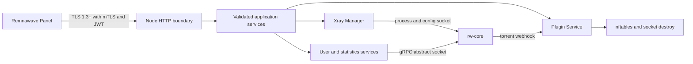

<div align="center">

# Remnanode Lite

**A resource-conscious Go implementation of Remnawave Node for small Linux servers**

[English](README.md) | [简体中文](README.zh-CN.md) | [Русский](README.ru.md)

[](https://github.com/luxiaba/remnanode-lite/actions/workflows/ci.yml)
[](https://github.com/luxiaba/remnanode-lite/actions/workflows/container.yml)
[](https://github.com/luxiaba/remnanode-lite/actions/workflows/security.yml)
[](go.mod)
[](LICENSE)

[Documentation](docs/README.md) · [Docker deployment](docs/deployment-docker.md) · [Architecture](docs/architecture.md) · [Development](docs/development/README.md) · [Versioning](docs/versioning.md) · [Release process](docs/release.md)

</div>

> [!IMPORTANT]
> Remnanode Lite is an independently maintained community project. It is not affiliated with or endorsed by Remnawave. The official `remnawave/node` repository defines an external behavior and protocol reference; it is not this repository's code upstream.

Remnanode Lite receives commands from Remnawave Panel and manages the rw-core lifecycle, live user updates, statistics, and plugin rules. A single Go Node process owns rw-core directly. The container does not require Node.js, s6, or a second application supervisor; native installations rely on systemd or OpenRC to supervise the Node process.

The production engineering target is a complete Linux host with **512 MiB RAM, 1 vCPU, and 2 GB of disk**. That target is a constrained operating envelope, not a blanket performance guarantee for every traffic pattern or plugin configuration.

## Why this project exists

Small edge nodes need more than a process that starts. They need verifiable Panel behavior, recoverable process and firewall state, bounded input and concurrency, controlled logs, and upgrades that can fail without silently corrupting the installation.

This repository began with experience from a community Go implementation, then re-audited and reworked the API contract, Xray lifecycle, plugin transactions, network administration, installation supply chain, and low-memory profile. The goal is not a line-by-line TypeScript port. It is an idiomatic Go system that preserves the observable contract while making ownership and resource limits explicit.

| Area | Current design |
| --- | --- |
| Panel contract | Pinned official source evidence for 26 `/node` routes, request and response schemas, error mapping, and observable side effects |
| Resource bounds | `LOW_MEMORY=1`, bounded bodies, queues and concurrency, a 448 MiB container limit, ephemeral runtime logs |
| Lifecycle | One owner for rw-core, explicit lifecycle states, separate operation and process epochs, process leases, bounded shutdown |
| Network effects | Project-owned nftables tables and dual-stack socket destruction with only `NET_ADMIN` and `NET_BIND_SERVICE` added |
| Delivery | amd64/arm64 GHCR candidates, SBOM, provenance, build attestation, and integrity-checked native release assets |

See [Project scope and goals](docs/project.md) for the background, supported boundaries, and non-goals.

## Current status

| Item | Current value |
| --- | --- |
| Project version | `2.8.0`; formal availability is defined by immutable Git tags and GitHub Releases |
| Official contract baseline | `remnawave/node 2.8.0@596f015a5c8f876dc9a9d61b6cb78d35bd8e379b` |
| Panel version used for integration acceptance | `2.8.1`; it does not determine the project version |
| rw-core | `v26.6.27` |
| Target architectures | `linux/amd64`, `linux/arm64` |
| M7 engineering snapshots | Ubuntu 24.04 arm64/systemd and Alpine 3.22 arm64/OpenRC container; these are not frozen-candidate M8 acceptance |
| Production resource target | Whole host `512 MiB / 1 vCPU / 2 GB disk`, service maximum `448 MiB`, no swap |

The static contract and code-level remediation are in place. A production Release still requires frozen-candidate Panel, init-system, dual-architecture, resource, fault, and soak evidence. Follow the [roadmap](docs/development/roadmap.md) and do not treat an engineering snapshot as a published SLA.

## Quick start

Docker Compose is the recommended deployment model. The repository includes a complete [single-file Compose template](deploy/compose.single-file.yaml) that does not require source code or a separate `.env` file.

Before a formal Release is available, and whenever validating a new candidate, select a real candidate from the [GHCR package](https://github.com/luxiaba/remnanode-lite/pkgs/container/remnanode-lite). Bind the image and deployment template to the same 40-character `main` commit:

```bash
(
  set -euo pipefail
  candidate_commit=REPLACE_WITH_40_CHAR_COMMIT
  candidate_tag="sha-${candidate_commit}"
  # For a manually rebuilt candidate, use candidate-sha-${candidate_commit}.
  printf '%s\n' "$candidate_commit" | grep -Eq '^[0-9a-f]{40}$'

  mkdir -p /opt/remnanode
  cd /opt/remnanode
  curl -fL \
    "https://raw.githubusercontent.com/luxiaba/remnanode-lite/${candidate_commit}/deploy/compose.single-file.yaml" \
    -o docker-compose.yaml
  sed -i \
    "s|ghcr.io/luxiaba/remnanode-lite:latest|ghcr.io/luxiaba/remnanode-lite:${candidate_tag}|" \
    docker-compose.yaml
  chmod 600 docker-compose.yaml
)
```

After a formal Release, download the matching Compose asset and `SHA256SUMS` from that GitHub Release instead. The release workflow pins the asset to the exact version rather than `latest`.

Edit only the node port and the complete Secret issued by Panel:

```yaml
environment:
  NODE_PORT: "38329"
  SECRET_KEY: "PASTE_THE_COMPLETE_BASE64_PANEL_SECRET"
```

Then start the node:

```bash
docker compose config --quiet
docker compose pull
docker compose up -d --no-build
docker compose ps
docker compose logs --tail=100 remnanode
```

> [!NOTE]
> `latest` is created only by a completed stable Release. `edge` follows the current `main` container build and is not a rollback target. A healthy container proves that the internal Unix socket accepts connections; it does not prove Panel reachability, mTLS/JWT validity, or that rw-core is online.

For image selection, digest pinning, Secret handling, logs, upgrades, and rollback, read [Docker Compose deployment](docs/deployment-docker.md). Native systemd and OpenRC installations are documented in [Native Linux deployment](docs/deployment-native.md).

## Runtime model



The central rule is single ownership of mutable state. The HTTP layer authenticates, validates, applies capacity limits, and coordinates operations. Application services do not depend on `net/http`. Xray Manager owns process and lifecycle state plus process leases. Plugin Service owns plugin snapshots and nftables transactions. See [Architecture and runtime design](docs/architecture.md) for the data flows, lock ordering, and package responsibilities.

## Image channels

| Tag | Meaning | Intended use |
| --- | --- | --- |
| `sha-<commit>` | Candidate built automatically from a `main` commit | Server acceptance; record the manifest digest for strict pinning |
| `candidate-sha-<commit>` | Independent candidate built by a manual workflow run on `main` | Rebuild or acceptance when the automatic candidate is unavailable |
| `edge` | Moving image for the current `main` head | Short-lived observation only |
| `X.Y.Z-rnl.N` | Independently versioned Remnanode Lite Release | Exact deployment and rollback |
| `X.Y.Z` | Formal Release after matching the official version's contract | Exact deployment and rollback |
| `latest` | Most recent Release that completed the full stable workflow | Opt-in stable tracking; running containers are not updated automatically |

`rnl.N` is this project's iteration number. It can identify work started ahead of a future official line or further work on an existing contract baseline; it is not an official revision number. The authoritative rules are in [Versioning and image tags](docs/versioning.md).

## Documentation map

| Goal | Start here |
| --- | --- |
| Decide whether the project fits a node | [Project scope](docs/project.md) · [Resource budget](docs/development/resource-budget.md) |
| Deploy or migrate | [Docker Compose](docs/deployment-docker.md) · [Native Linux](docs/deployment-native.md) |
| Configure, observe, or troubleshoot | [Configuration](docs/configuration.md) · [Operations](docs/operations.md) |
| Understand the implementation | [Architecture](docs/architecture.md) · [2.8.0 contract baseline](docs/development/contract-2.8.0.md) |
| Contribute code | [Development guide](docs/development/README.md) · [Testing](docs/development/testing.md) · [Contributing](CONTRIBUTING.md) |
| Prepare a Release | [Versioning](docs/versioning.md) · [Release process](docs/release.md) |
| Review security boundaries | [Security policy](SECURITY.md) |

The complete role-based index is available in [docs/README.md](docs/README.md).

## Development

Ordinary unit tests do not require Panel, a Secret, or rw-core:

```bash
git switch dev
go mod download
go test -count=1 ./...
mkdir -p bin
go build -trimpath -o bin/remnanode-lite ./cmd/remnanode-lite
./bin/remnanode-lite version
```

Linux nftables, socket destruction, real rw-core, Panel differential testing, and Release acceptance are separate test layers. A local `go test ./...` run on macOS does not replace them. Read the [development guide](docs/development/README.md) and [testing strategy](docs/development/testing.md) before changing those areas.

## Security boundary

The container uses host networking and holds `NET_ADMIN`, so it can affect the host network namespace. Run only trusted images and prefer an exact version or manifest digest. An inline Docker Secret is visible in local Docker metadata; keep the Compose file at mode `0600` and tightly restrict Docker socket and host administrator access.

Do not disclose exploit details, Secrets, certificates, or real node information in a public Issue. Follow [SECURITY.md](SECURITY.md) for private vulnerability reporting.

## License

Remnanode Lite is licensed under [AGPL-3.0-only](LICENSE).
