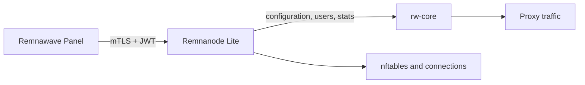

<div align="center">

# Remnanode Lite

**A lightweight Remnawave Node implementation in Go for small Linux servers**

[English](README.md) | [简体中文](README.zh-CN.md) | [Русский](README.ru.md)

[](https://github.com/luxiaba/remnanode-lite/actions/workflows/ci.yml)
[](https://github.com/luxiaba/remnanode-lite/actions/workflows/container.yml)
[](https://github.com/luxiaba/remnanode-lite/actions/workflows/security.yml)
[](go.mod)
[](LICENSE)

[Docker quick start](#docker-quick-start) · [Configuration](docs/configuration.md) · [Operations](docs/operations.md) · [Documentation](docs/README.md)

</div>

Remnanode Lite runs a Remnawave-compatible Node on Linux. It receives configuration from Remnawave Panel, supervises rw-core, manages users and plugin rules, and reports system and traffic statistics. The Docker image bundles rw-core and its runtime data files.

The maintained deployment profile is designed for a server with **512 MiB RAM, 1 vCPU, and 2 GB of disk**. Images are available for both `linux/amd64` and `linux/arm64`.

> [!NOTE]
> Remnanode Lite is an independent community project. It is not affiliated with or endorsed by Remnawave. Compatibility follows the public behavior of the official Node, while this codebase is developed and maintained independently.

## Highlights

- Implements the Remnawave Node `2.8.0` API contract.
- Runs the Node as one Go process that directly manages rw-core, without Node.js or s6.
- Includes a maintained low-memory Compose profile for 512 MiB servers.
- Supports live user updates, statistics, connection management, and the official plugin rule formats.
- Publishes multi-architecture images to GHCR with SBOM, provenance, and build attestations.
- Uses one Compose file for deployment. No source tree, `.env` file, or persistent data volume is required.

## Docker quick start

You need Docker Engine with Compose v2, a Node created in Remnawave Panel, and the complete Secret Key for that Node. The port must be reachable from the Panel. Commands below assume a root shell; use `sudo` where needed.

Download the Compose file from the latest stable Release:

```bash
mkdir -p /opt/remnanode
cd /opt/remnanode

curl -fL \
  https://github.com/luxiaba/remnanode-lite/releases/latest/download/docker-compose.single-file.yaml \
  -o docker-compose.yaml

chmod 600 docker-compose.yaml
```

The downloaded file is pinned to the exact image version from that Release.

Open `docker-compose.yaml` and set the port and complete Secret from the Panel:

```yaml
environment:
  NODE_PORT: "38329"
  SECRET_KEY: "PASTE_THE_COMPLETE_PANEL_SECRET_KEY"
```

Start the Node:

```bash
cd /opt/remnanode
docker compose config --quiet
docker compose pull
docker compose up -d --no-build
docker compose ps
docker compose logs --tail=100 remnanode
```

The container should become healthy, then the Node should return online in the Panel. Confirm the deployment with real proxy traffic. Container health alone does not check Panel connectivity or rw-core traffic.

The official container's `NODE_PORT` and `SECRET_KEY` can be reused when migrating. Stop the old container before starting this one. The [Docker deployment guide](docs/deployment-docker.md) covers migration, exact-version installs, digest pinning, and rollback.

## Common Docker environment variables

Most deployments only need to change `NODE_PORT` and `SECRET_KEY`. Add optional values under the same Compose `environment` mapping when they are needed.

| Variable | Required | Release Compose value | Purpose |
| --- | --- | --- | --- |
| `NODE_PORT` | Yes | `38329` | HTTPS port used by the Panel. It must match the Node port configured there. |
| `SECRET_KEY` | Yes | Placeholder | Complete base64 or base64url Secret supplied by the Panel. |
| `LOW_MEMORY` | No | `1` | Enables the low-memory limits used by the small-server profile. |
| `NODE_BIND_ADDR` | No | Not set | Listen on a specific local address. When unset, the Node listens on all local addresses. |
| `BODY_LIMIT_MB` | No | Automatic | Overrides the Node API body limit. Low-memory mode selects 16 MiB automatically. |
| `GOMEMLIMIT` | No | Automatic | Overrides the Go runtime soft memory limit. Low-memory mode selects 180 MiB automatically. |

Keep the mapping form shown above. Do not write `- SECRET_KEY="..."`: in that list form the quote characters become part of the value and the Secret cannot be decoded. Keep the Compose file private because Docker stores inline environment values in its local metadata.

See the [configuration reference](docs/configuration.md) for every runtime setting, accepted value, and precedence rule.

## Everyday operations

Follow the Node logs:

```bash
docker compose logs --tail=100 -f remnanode
```

Follow rw-core output and errors:

```bash
docker exec -it remnanode tail -n 50 -F \
  /var/log/remnanode/xray.out.log \
  /var/log/remnanode/xray.err.log
```

Check the running version:

```bash
docker exec remnanode remnanode-lite version
```

To update, change `image:` first when moving between exact versions, then pull and recreate the container:

```bash
docker compose pull
docker compose up -d --no-build --force-recreate
```

`latest` is only checked when you pull; it never updates a running container by itself. rw-core logs live in tmpfs, while Node logs use Docker's rotating `json-file` driver. See the [operations guide](docs/operations.md) for health checks, troubleshooting, rollout, and rollback.

## Versions and image tags

| Tag | Use |
| --- | --- |
| `X.Y.Z` | Stable Release aligned with the corresponding official Node contract. Recommended for production and rollback. |
| `X.Y.Z-rnl.N` | A tested Remnanode Lite iteration for work ahead of or beyond an official alignment point. |
| `latest` | The most recently completed stable Release. It moves, so it is not a rollback reference. |
| `sha-<commit>` / `candidate-sha-<commit>` | Images for testing a specific `main` candidate before Release. |
| `edge` | Current `main` image for short-lived testing only. |

For a fleet, prefer one exact version or manifest digest and keep the previous value for rollback. The full policy is in [Versioning and image tags](docs/versioning.md).

## Compatibility

| Item | Current baseline |
| --- | --- |
| Node contract | `2.8.0` |
| rw-core | `v26.6.27` |
| Platforms | `linux/amd64`, `linux/arm64` |
| Whole-host target | `512 MiB RAM / 1 vCPU / 2 GB disk` |
| Compose service limit | `448 MiB RAM`, no additional swap |

The resource target is the baseline for the maintained Compose profile, not a promise that every traffic pattern or plugin configuration fits the same machine. Measurements and limits are documented in the [resource budget](docs/development/resource-budget.md).

## How it fits together



The Node owns the rw-core process and current runtime state. The Panel remains the source of truth for the active Xray configuration, so a recreated container does not need a configuration volume. Read [Architecture and runtime design](docs/architecture.md) for package boundaries, lifecycle rules, and data flows.

## Documentation

| Goal | Start here |
| --- | --- |
| Deploy or migrate a Node | [Docker Compose](docs/deployment-docker.md) · [Native Linux](docs/deployment-native.md) |
| Configure and operate it | [Configuration](docs/configuration.md) · [Operations](docs/operations.md) |
| Understand the project | [Project scope](docs/project.md) · [Architecture](docs/architecture.md) |
| Work on the code | [Development guide](docs/development/README.md) · [Testing](docs/development/testing.md) · [Contributing](CONTRIBUTING.md) |
| Understand versions and Releases | [Versioning](docs/versioning.md) · [Release process](docs/release.md) |
| Report or review security issues | [Security policy](SECURITY.md) |

The [documentation index](docs/README.md) contains the complete English documentation and links to the Chinese and Russian translations.

## Development

Ordinary unit tests do not need a Panel, Secret, or running rw-core:

```bash
git switch dev
go mod download
go test -count=1 ./...
mkdir -p bin
go build -trimpath -o bin/remnanode-lite ./cmd/remnanode-lite
./bin/remnanode-lite version
```

Linux network integration, real rw-core behavior, Panel compatibility, and Release acceptance are separate test layers. Start with the [development guide](docs/development/README.md) before changing those areas.

## Security

The container uses host networking and holds `NET_ADMIN`, so it can change networking state on the host. Run only trusted images and prefer an exact version or manifest digest. Keep the Compose file at mode `0600`, and restrict access to the Docker socket and host administrator accounts.

Do not post Secrets, certificates, real Node details, or vulnerability exploits in a public Issue. Follow [SECURITY.md](SECURITY.md) for private reporting.

## License

Remnanode Lite is licensed under [AGPL-3.0-only](LICENSE).
