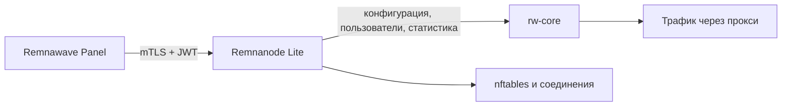

<!-- translation: locale=ru; source=README.md; source-sha256=2a51b5a4198c0792967943da93346ef116b2d1c53f804b92fbe42237938d35e9 -->
<div align="center">

# Remnanode Lite

**Лёгкая реализация Remnawave Node на Go для небольших Linux-серверов**

[English](README.md) | [简体中文](README.zh-CN.md) | **Русский**

**Это перевод. Актуальной считается [английская версия README.md](README.md).**

[](https://github.com/luxiaba/remnanode-lite/actions/workflows/ci.yml)
[](https://github.com/luxiaba/remnanode-lite/actions/workflows/container.yml)
[](https://github.com/luxiaba/remnanode-lite/actions/workflows/security.yml)
[](go.mod)
[](LICENSE)

[Быстрый запуск Docker](#быстрый-запуск-docker) · [Native Linux](#native-linux) · [Настройка](docs/i18n/ru/configuration.md) · [Эксплуатация](docs/i18n/ru/operations.md) · [Документация](docs/i18n/ru/README.md)

</div>

Remnanode Lite работает как Remnawave-совместимый Node на Linux. Он получает конфигурацию из Remnawave Panel, управляет процессом rw-core, пользователями и правилами плагинов, а также отправляет статистику системы и трафика. Docker-образ и опубликованный Native bundle содержат rw-core и данные времени выполнения, выбранные для соответствующего Release.

Поддерживаемая конфигурация развёртывания рассчитана на сервер с **512 MiB RAM, 1 vCPU и 2 GB диска**. Образы доступны для `linux/amd64` и `linux/arm64`.

> [!NOTE]
> Remnanode Lite является независимым проектом сообщества, не связанным с Remnawave и не имеющим её официальной поддержки. Совместимость с официальным Node основана на его публично наблюдаемом поведении; код проекта разрабатывается и сопровождается независимо.

## Возможности

- Реализует контракт API Remnawave Node `2.8.0`.
- Node работает как единый процесс на Go и напрямую управляет rw-core; Node.js и s6 не требуются.
- Включает поддерживаемый Compose-профиль с пониженным потреблением памяти для серверов с 512 MiB RAM.
- Поддерживает обновление пользователей на лету, сбор статистики, управление соединениями и официальные форматы правил плагинов.
- Публикует в GHCR мультиархитектурные образы с SBOM, данными о происхождении и аттестациями сборки.
- Native Linux поддерживает транзакционные установку, обновление, откат и восстановление через `rnlctl`.
- Для развёртывания достаточно одного Compose-файла. Исходный код и постоянный том данных не нужны, а `.env` остаётся необязательным.

## Выбор способа развёртывания

| | Docker Compose | Native Linux |
| --- | --- | --- |
| Когда выбирать | Docker Engine с Compose v2 уже доступен; это вариант по умолчанию. | Docker нельзя установить либо постоянные расходы Docker daemon и container runtime для хоста не подходят. |
| Установка | Скачайте Compose-asset Release и задайте Secret Panel в `.env` или в намеренно встроенном mapping. | Скачайте точный Release, проверьте `install.sh` и запустите installer от root. |
| Обновление и откат | Выберите точный tag или digest образа, выполните pull и recreate; для отката верните предыдущую ссылку на образ. | Используйте `rnlctl upgrade --to VERSION` и `rnlctl rollback`; сохраняется один проверенный previous generation. |
| Служба хоста | Нужны Docker Engine daemon и container runtime. | Docker Engine daemon и container runtime не нужны, но `remnanode-lite` всё равно работает как фоновая служба systemd или OpenRC. |
| Выбор версии | Рекомендуются точный tag или manifest digest; `latest` и `preview` — явно выбранные движущиеся каналы. | Только точные Releases `X.Y.Z` или `X.Y.Z-rnl.N`; движущиеся каналы образов не разрешаются. |

Оба варианта используют host networking и требуют `NET_ADMIN`. Не запускайте их рядом с другим Node, использующим те же Panel или proxy ports.

## Быстрый запуск Docker

Для запуска потребуются Docker Engine с Compose v2, узел, созданный в Remnawave Panel, и его полный Secret Key. Порт узла должен быть доступен со стороны Panel. Команды ниже предполагают запуск из оболочки `root`; при необходимости добавьте `sudo`.

Выберите версию, показанную на странице GitHub Releases, затем скачайте Compose-файл и шаблон переменных окружения из этого точного Release. Версия в исходном коде или образ-кандидат не являются загружаемым Release:

```bash
mkdir -p /opt/remnanode-lite
cd /opt/remnanode-lite

VERSION="<published-version>" # например: X.Y.Z или X.Y.Z-rnl.N
BASE="https://github.com/luxiaba/remnanode-lite/releases/download/v${VERSION}"

curl -fL \
  "${BASE}/docker-compose.single-file.yaml" \
  -o docker-compose.yaml
curl -fL \
  "${BASE}/remnanode-lite.env.example" \
  -o .env

chmod 600 docker-compose.yaml .env
```

Compose CLI автоматически читает `.env` из этого каталога. Оба скачанных файла выбирают точную версию образа из соответствующего выпуска. Укажите в `.env` порт узла и полный Secret Key из Panel:

```env
NODE_PORT=38329
SECRET_KEY=PASTE_THE_COMPLETE_PANEL_SECRET_KEY
```

Значение `NODE_PORT` по умолчанию в Compose равно `2222`; `38329` приведено только как пример. Выбранный порт должен совпадать с портом узла в Panel.

Существующие установки могут продолжать использовать свой текущий каталог; для обновления переименовывать его не требуется.

Чтобы сохранить буквально однофайловое развёртывание без `.env`, замените подстановку `SECRET_KEY` в `docker-compose.yaml` полным значением. В следующем примере значение порта по умолчанию также изменено на `38329`:

```yaml
environment:
  NODE_PORT: "${NODE_PORT:-38329}"
  SECRET_KEY: "PASTE_THE_COMPLETE_PANEL_SECRET_KEY"
```

Запустите узел:

```bash
cd /opt/remnanode-lite
docker compose config --quiet
docker compose pull
docker compose up -d --no-build
docker compose ps
docker compose logs --tail=100 remnanode-lite
```

Контейнер должен перейти в состояние `healthy`, после чего узел появится в Panel как подключённый. Затем проверьте прохождение реального трафика через прокси. Статус `healthy` сам по себе не подтверждает связь с Panel или прохождение трафика через rw-core.

При переходе с официального контейнера можно сохранить прежние `NODE_PORT` и `SECRET_KEY`, но перед запуском нового контейнера необходимо остановить старый. В [руководстве по Docker](docs/i18n/ru/deployment-docker.md) описаны миграция, установка конкретной версии, закрепление образа по дайджесту и откат.

## Native Linux

Используйте Native bundle, когда Docker Engine нельзя установить или когда постоянные расходы Docker daemon и container runtime для хоста не подходят. Native не означает отсутствие фоновой службы: `remnanode-lite` запускается непосредственно systemd или OpenRC. Основная цель — Rocky Linux 9 с systemd; Rocky Linux 8 и Debian 12 совместимы. OpenRC является экспериментальным путём и требует рабочего cgroup v2.

Native-установка никогда не следует за движущимся каналом. Выберите опубликованную версию на странице GitHub Releases, затем скачайте `install.sh` и `SHA256SUMS` из этого точного Release, проверьте installer и явно укажите версию:

```bash
VERSION="<published-version>" # например: X.Y.Z или X.Y.Z-rnl.N
BASE="https://github.com/luxiaba/remnanode-lite/releases/download/v${VERSION}"

curl -fLO "${BASE}/install.sh"
curl -fLO "${BASE}/SHA256SUMS"
grep '  install.sh$' SHA256SUMS | sha256sum --check --strict -

sudo sh ./install.sh --version "$VERSION" --port 38329
```

Если действующий Secret ещё не установлен, installer безопасно запросит полный Secret Panel в терминале. Он проверяет и устанавливает полный generation: Node, `rnlctl`, rw-core, GeoIP, GeoSite, ASN data и service definitions. После старта:

```bash
sudo rnlctl status --json
sudo rnlctl doctor
sudo rnlctl logs node --lines 100
```

Native bundle использует тот же контракт, что и соответствующий Release. Перед массовым развёртыванием прочитайте [руководство Native Linux](docs/i18n/ru/deployment-native.md): prerequisites, unattended и offline installation, точное обновление, откат, repair и uninstall.

## Переменные окружения Docker Compose

В большинстве случаев достаточно задать `NODE_PORT` и `SECRET_KEY`. Поддерживаемые Compose-файлы подставляют ровно восемь переменных:

| Переменная | Обязательна в `.env` | Значение по умолчанию в Compose | Назначение |
| --- | --- | --- | --- |
| `REMNANODE_IMAGE` | Нет | Точный образ, выбранный Compose-файлом Release | Тег образа или `name@sha256:...`; используется Compose и не передаётся в Node. |
| `NODE_PORT` | Нет | `2222` | HTTPS-порт для связи с Panel. Должен совпадать с портом узла в Panel. |
| `NODE_BIND_ADDR` | Нет | Пусто | Задаёт локальный адрес прослушивания. Пустое значение означает все локальные адреса. |
| `SECRET_KEY` | Да, если не задан прямо в YAML | Нет; пустое значение прерывает подстановку | Полный Secret Key в формате base64 или base64url, выданный Panel. |
| `LOW_MEMORY` | Нет | `1` | Включает параметры для работы на сервере с небольшим объёмом памяти. |
| `DISABLE_HASHED_SET_CHECK` | Нет | `false` | Отладочный переключатель, заставляющий каждый запрос start перезапускать rw-core. |
| `BODY_LIMIT_MB` | Нет | Пусто (автоматически) | Переопределяет предел тела запроса API Node. В режиме малого объёма памяти автоматически выбирается 16 MiB. |
| `GOMEMLIMIT` | Нет | Пусто (автоматически) | Переопределяет мягкий лимит памяти Go. В режиме малого объёма памяти автоматически выбирается 180 MiB. |

При подстановке действует приоритет: окружение shell > `.env` > значение по умолчанию в Compose-файле. Форма `:-` использует значение по умолчанию, если итоговое значение не задано или пусто. Compose передаёт только семь переменных времени выполнения, явно перечисленных в `environment`; `REMNANODE_IMAGE` используется только самим Compose, а неизвестные ключи из `.env` не попадают в контейнер.

Задавайте переменные в виде YAML-словаря, как показано выше. Не используйте `- SECRET_KEY="..."`: при записи списком кавычки становятся частью значения, и `SECRET_KEY` не удаётся декодировать. Compose-файл содержит секретный ключ, а значения переменных окружения видны в локальных метаданных Docker, поэтому сохраняйте для файла права `0600`.

Все параметры, допустимые значения и порядок приоритетов приведены в [справочнике конфигурации](docs/i18n/ru/configuration.md).

## Повседневные операции

Просмотр журналов Node:

```bash
docker compose logs --tail=100 -f remnanode-lite
```

Просмотр вывода и ошибок rw-core:

```bash
docker exec -it remnanode-lite sh -c \
  'tail -n 50 -F "$LOG_DIR/xray.out.log" "$LOG_DIR/xray.err.log"'
```

Проверка запущенной версии:

```bash
docker exec remnanode-lite remnanode-lite version
```

При переходе между точными версиями сначала измените `REMNANODE_IMAGE` в
`.env`. Если вы намеренно работаете без `.env`, измените вместо этого `image:`
в Compose-файле. Затем загрузите образ и пересоздайте контейнер:

```bash
docker compose pull
docker compose up -d --no-build --force-recreate
```

При использовании `latest` контейнер перейдёт на новый стабильный образ только после явного pull и пересоздания; работающий контейнер сам по себе не обновляется. Журналы rw-core находятся в tmpfs, а журналы Node сохраняются и ротируются драйвером Docker `json-file`. Проверка состояния, диагностика, поэтапное обновление и откат описаны в [руководстве по эксплуатации](docs/i18n/ru/operations.md).

## Версии и теги образов

| Тег | Назначение |
| --- | --- |
| `X.Y.Z` | Стабильный релиз, совместимый с контрактом соответствующей версии официального Node. Рекомендуется для эксплуатации и отката. |
| `X.Y.Z-rnl.N` | Проверенная итерация Remnanode Lite: ранняя работа над будущей версией или дополнительные улучшения уже согласованной версии. |
| `latest` | Последний опубликованный стабильный релиз. Тег перемещается и не подходит для отката. |
| `preview` | Последний продвинутый prerelease `rnl.N`; он не сдвигает `latest`. |
| `sha-<commit>` | Неизменяемый образ из конкретного коммита `main`. Используется для проверки кандидата на выпуск. |
| `edge` | Перемещаемый образ текущего `main`, только для кратковременного тестирования. |

Для группы серверов используйте один фиксированный тег версии или дайджест манифеста и сохраняйте предыдущее значение для отката. Полные правила приведены в [документе о версиях и тегах](docs/i18n/ru/versioning.md).

## Совместимость

| Компонент | Текущее значение |
| --- | --- |
| Native Linux bundle | Точные опубликованные Releases |
| Контракт Node | `2.8.0` |
| rw-core | `v26.6.27` |
| Платформы | `linux/amd64`, `linux/arm64` |
| Целевая конфигурация хоста | `512 MiB RAM / 1 vCPU / 2 GB диска` |
| Лимит сервиса в Compose | `448 MiB RAM`, без дополнительной подкачки |

Размер хоста является проектной целью. Поддерживаемый профиль Compose строго ограничивает контейнер значениями `448 MiB / 1 CPU` без дополнительной подкачки и оставляет часть ресурсов хосту.

Указанные ресурсы относятся к поддерживаемому Compose-профилю и не гарантируют, что любая нагрузка или любой набор плагинов будут работать на сервере той же конфигурации. Результаты измерений и ограничения приведены в [описании бюджета ресурсов (на английском)](docs/development/resource-budget.md).

## Как это работает



Node управляет процессом rw-core и текущим состоянием сервиса. Активная конфигурация Xray поступает из Panel, поэтому после пересоздания контейнера отдельный том для конфигурации не нужен. Границы между пакетами, правила жизненного цикла и потоки данных описаны в [документе об архитектуре (на английском)](docs/architecture.md).

## Документация

| Задача | С чего начать |
| --- | --- |
| Развернуть или перенести узел | [Docker Compose](docs/i18n/ru/deployment-docker.md) · [Установка в Linux без Docker](docs/i18n/ru/deployment-native.md) |
| Настроить и обслуживать узел | [Конфигурация](docs/i18n/ru/configuration.md) · [Эксплуатация](docs/i18n/ru/operations.md) |
| Понять устройство проекта | [Область проекта](docs/i18n/ru/project.md) · [Архитектура (англ.)](docs/architecture.md) |
| Работать с кодом | [Разработка (англ.)](docs/development/README.md) · [Тестирование (англ.)](docs/development/testing.md) · [Участие в проекте (англ.)](CONTRIBUTING.md) |
| Разобраться в версиях и выпусках | [Версии](docs/i18n/ru/versioning.md) · [Процесс выпуска (англ.)](docs/release.md) |
| Сообщить о проблеме безопасности | [Политика безопасности](docs/i18n/ru/security.md) |

В [русскоязычном указателе документации](docs/i18n/ru/README.md) собраны остальные руководства и ссылки на материалы на английском языке.

## Разработка

Обычные модульные тесты не требуют доступа к Panel, Secret Key или запущенного rw-core:

```bash
git switch dev
go mod download
go test -count=1 ./...
mkdir -p bin
go build -trimpath -o bin/remnanode-lite ./cmd/remnanode-lite
go build -trimpath -o bin/rnlctl ./cmd/rnlctl
./bin/remnanode-lite version
./bin/rnlctl version
```

Сетевые интеграционные тесты в Linux, проверки с реальным rw-core и совместимость с Panel относятся к отдельным уровням тестирования. Перед изменением этих частей ознакомьтесь с [руководством разработчика (на английском)](docs/development/README.md).

## Безопасность

Контейнер использует сетевой режим хоста (`network_mode: host`) и получает Linux-привилегию `NET_ADMIN`, поэтому может изменять сетевые настройки хоста. Запускайте только доверенные образы; для эксплуатации выбирайте фиксированную версию или дайджест манифеста. Установите на Compose-файл права `0600` и ограничьте доступ к сокету Docker и административным учётным записям хоста.

Не публикуйте секретные ключи, сертификаты, реальные данные узла, код эксплойтов или подробности уязвимостей в открытых Issues. Порядок конфиденциального сообщения приведён в [политике безопасности](docs/i18n/ru/security.md).

## Лицензия

Remnanode Lite распространяется по лицензии [AGPL-3.0-only](LICENSE).
