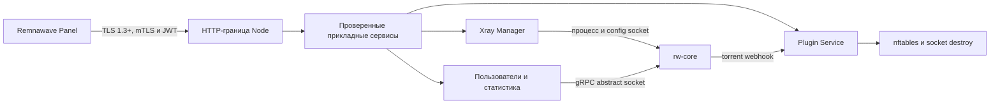

<!-- translation: locale=ru; source=README.md; source-sha256=4803d9b11e8b118d4fba089408f1429349f9e687a7e9dd41bdfac800777ea377 -->
<div align="center">

# Remnanode Lite

**Ресурсосберегающая реализация Remnawave Node на Go для небольших Linux-серверов**

[English](README.md) | [简体中文](README.zh-CN.md) | [Русский](README.ru.md)

Английский [README.md](README.md) является единственным нормативным источником. Этот перевод предназначен для удобства операторов и может обновляться с задержкой.

[](https://github.com/luxiaba/remnanode-lite/actions/workflows/ci.yml)
[](https://github.com/luxiaba/remnanode-lite/actions/workflows/container.yml)
[](https://github.com/luxiaba/remnanode-lite/actions/workflows/security.yml)
[](go.mod)
[](LICENSE)

[Документация](docs/i18n/ru/README.md) · [Развертывание Docker](docs/i18n/ru/deployment-docker.md) · [Архитектура, English](docs/architecture.md) · [Разработка, English](docs/development/README.md) · [Версионирование](docs/i18n/ru/versioning.md) · [Выпуск, English](docs/release.md)

</div>

> [!IMPORTANT]
> Remnanode Lite является независимо сопровождаемым проектом сообщества. Проект не связан с Remnawave и не поддерживается ею официально. Официальный репозиторий `remnawave/node` служит эталоном внешнего поведения и протокола, но не является upstream-репозиторием этого кода.

Remnanode Lite принимает команды от Remnawave Panel и управляет жизненным циклом rw-core, оперативным обновлением пользователей, статистикой и правилами плагинов. Единственный процесс Node на Go напрямую владеет rw-core. В контейнере не требуются Node.js, s6 или второй прикладной supervisor; при нативной установке процесс Node контролируется systemd или OpenRC.

Целевая производственная конфигурация всего Linux-хоста: **512 MiB RAM, 1 vCPU и 2 GB диска**. Это инженерная граница для ограниченной среды, а не безусловная гарантия производительности при любой нагрузке и наборе плагинов.

## Зачем нужен проект

Малому edge-узлу недостаточно просто запустить процесс. Нужны проверяемое взаимодействие с Panel, восстанавливаемое состояние процессов и firewall, ограниченные входные данные и параллелизм, контролируемые журналы и обновление без скрытого повреждения установки при ошибке.

Репозиторий вырос из опыта работы с реализацией на Go, созданной сообществом, после чего контракт API, жизненный цикл Xray, транзакции плагинов, сетевое администрирование, цепочка поставки установщика и профиль малого потребления памяти были заново проверены и переработаны. Цель проекта не в построчном переносе TypeScript, а в идиоматичной системе на Go с сохранением наблюдаемого контракта, явным владением состоянием и измеримыми лимитами ресурсов.

| Область | Текущая модель |
| --- | --- |
| Контракт Panel | Зафиксированные доказательства из официального исходного кода для 26 маршрутов `/node`, схем запросов и ответов, ошибок и наблюдаемых побочных эффектов |
| Ресурсы | `LOW_MEMORY=1`, ограниченные тела запросов, очереди и параллелизм, лимит контейнера 448 MiB, временные runtime-журналы |
| Жизненный цикл | Единственный владелец rw-core, явные состояния, раздельные operation/process epoch, process lease и ограниченное завершение |
| Сетевые эффекты | Собственные таблицы nftables и удаление dual-stack соединений; добавляются только `NET_ADMIN` и `NET_BIND_SERVICE` |
| Поставка | Кандидатные образы GHCR для amd64/arm64, SBOM, provenance, build attestation и нативные артефакты с проверкой целостности |

Предыстория, границы поддержки и нецели описаны в [обзоре проекта](docs/i18n/ru/project.md).

## Текущее состояние

| Параметр | Значение |
| --- | --- |
| Версия проекта | `2.8.0`; факт публикации определяется неизменяемыми Git-тегами и GitHub Releases |
| Базовый официальный контракт | `remnawave/node 2.8.0@596f015a5c8f876dc9a9d61b6cb78d35bd8e379b` |
| Версия Panel для интеграционной приемки | `2.8.1`; она не определяет версию проекта |
| rw-core | `v26.6.27` |
| Целевые архитектуры | `linux/amd64`, `linux/arm64` |
| Инженерные снимки M7 | Ubuntu 24.04 arm64/systemd и контейнер Alpine 3.22 arm64/OpenRC; это не приемка M8 замороженного кандидата |
| Целевые ресурсы | Весь хост `512 MiB / 1 vCPU / 2 GB disk`, максимум сервиса `448 MiB`, без swap |

Статический контракт и исправления на уровне кода подготовлены. Для производственного Release все еще нужны доказательства на замороженном кандидате: Panel, обе init-системы, обе архитектуры, ресурсы, отказы и длительный soak. Следуйте [roadmap, English](docs/development/roadmap.md) и не принимайте инженерный снимок за опубликованный SLA.

## Быстрый запуск

Для эксплуатации рекомендуется Docker Compose. Полный [однофайловый шаблон Compose](deploy/compose.single-file.yaml) не требует исходного кода или отдельного `.env`.

До появления формального Release, а также при проверке каждого нового кандидата выбирайте реально существующий образ в [пакете GHCR](https://github.com/luxiaba/remnanode-lite/pkgs/container/remnanode-lite). Образ и шаблон развертывания должны происходить из одного и того же 40-символьного commit в `main`:

```bash
(
  set -euo pipefail
  candidate_commit=REPLACE_WITH_40_CHAR_COMMIT
  candidate_tag="sha-${candidate_commit}"
  # Для кандидата, пересобранного вручную, используйте candidate-sha-${candidate_commit}.
  printf '%s\n' "$candidate_commit" | grep -Eq '^[0-9a-f]{40}$'

  mkdir -p /opt/remnanode
  cd /opt/remnanode
  curl -fL \
    "https://raw.githubusercontent.com/luxiaba/remnanode-lite/${candidate_commit}/deploy/compose.single-file.yaml" \
    -o docker-compose.yaml
  sed -i \
    "s|ghcr.io/luxiaba/remnanode-lite:latest|ghcr.io/luxiaba/remnanode-lite:${candidate_tag}|" \
    docker-compose.yaml
  chmod 600 docker-compose.yaml
)
```

После официального Release загружайте соответствующий Compose-артефакт и `SHA256SUMS` из этого GitHub Release. Workflow выпуска фиксирует в артефакте точную версию, а не `latest`.

Укажите только порт узла и полный Secret, выданный Panel:

```yaml
environment:
  NODE_PORT: "38329"
  SECRET_KEY: "PASTE_THE_COMPLETE_BASE64_PANEL_SECRET"
```

Запустите узел:

```bash
docker compose config --quiet
docker compose pull
docker compose up -d --no-build
docker compose ps
docker compose logs --tail=100 remnanode
```

> [!NOTE]
> `latest` появляется только после завершенного стабильного Release. `edge` следует за текущей контейнерной сборкой `main` и не подходит для отката. Статус healthy доказывает, что внутренний Unix socket принимает соединения, но не подтверждает доступность Panel, корректность mTLS/JWT или работу rw-core.

Выбор образа, фиксация digest, работа с Secret, журналы, обновление и откат описаны в [руководстве Docker Compose](docs/i18n/ru/deployment-docker.md). Нативные установки systemd и OpenRC описаны в [руководстве для Linux](docs/i18n/ru/deployment-native.md).

## Модель выполнения



Основное правило: у изменяемого состояния есть один владелец. HTTP-слой выполняет аутентификацию, валидацию, ограничение емкости и координацию. Прикладные сервисы не зависят от `net/http`. Xray Manager владеет процессом, жизненным циклом и process lease. Plugin Service владеет снимками плагинов и транзакциями nftables. Подробности приведены в [архитектуре, English](docs/architecture.md).

## Каналы образов

| Тег | Значение | Назначение |
| --- | --- | --- |
| `sha-<commit>` | Автоматический кандидат для commit в `main` | Серверная приемка; для строгой фиксации сохраните manifest digest |
| `candidate-sha-<commit>` | Независимый кандидат из ручного запуска workflow на `main` | Пересборка или приемка при отсутствии автоматического кандидата |
| `edge` | Перемещаемый образ текущего `main` | Только кратковременное наблюдение |
| `X.Y.Z-rnl.N` | Самостоятельно версионируемый Release проекта | Точное развертывание и откат |
| `X.Y.Z` | Формальный Release после выравнивания с официальным контрактом этой версии | Точное развертывание и откат |
| `latest` | Последний Release, полностью прошедший стабильный workflow | Добровольное слежение за стабильной версией; контейнер сам не обновляется |

`rnl.N` является номером итерации этого проекта. Он может обозначать раннюю работу над будущей линией или дальнейшее развитие существующего контракта и не является номером исправления официального проекта. Нормативные правила приведены в [политике версий](docs/i18n/ru/versioning.md).

## Навигация

| Задача | Документ |
| --- | --- |
| Оценить применимость проекта | [Обзор проекта](docs/i18n/ru/project.md) · [Бюджет ресурсов, English](docs/development/resource-budget.md) |
| Развернуть или мигрировать узел | [Docker Compose](docs/i18n/ru/deployment-docker.md) · [Нативный Linux](docs/i18n/ru/deployment-native.md) |
| Настроить и диагностировать | [Конфигурация](docs/i18n/ru/configuration.md) · [Эксплуатация](docs/i18n/ru/operations.md) |
| Изучить реализацию | [Архитектура, English](docs/architecture.md) · [Контракт 2.8.0, English](docs/development/contract-2.8.0.md) |
| Изменить код | [Разработка, English](docs/development/README.md) · [Тестирование, English](docs/development/testing.md) · [CONTRIBUTING, English](CONTRIBUTING.md) |
| Подготовить Release | [Версионирование](docs/i18n/ru/versioning.md) · [Процесс выпуска, English](docs/release.md) |
| Проверить безопасность | [Политика безопасности](docs/i18n/ru/security.md) |

Полный operator-индекс находится в [русской документации](docs/i18n/ru/README.md).

## Разработка

Обычные unit-тесты не требуют Panel, Secret или rw-core:

```bash
git switch dev
go mod download
go test -count=1 ./...
mkdir -p bin
go build -trimpath -o bin/remnanode-lite ./cmd/remnanode-lite
./bin/remnanode-lite version
```

Linux nftables, уничтожение соединений, реальный rw-core, дифференциальное тестирование Panel и приемка Release являются отдельными уровнями. Локальный `go test ./...` на macOS их не заменяет. Перед изменениями прочитайте [руководство разработчика, English](docs/development/README.md) и [стратегию тестирования, English](docs/development/testing.md).

## Граница безопасности

Контейнер использует host networking и обладает `NET_ADMIN`, поэтому может влиять на сетевое пространство имен хоста. Запускайте только доверенные образы и предпочитайте точную версию или manifest digest. Встроенный Docker Secret виден в локальных метаданных Docker; храните Compose-файл с правами `0600` и строго ограничивайте доступ к Docker socket и административным учетным записям.

Не публикуйте детали эксплуатации уязвимости, Secrets, сертификаты или реальные данные узла в открытом Issue. Используйте [политику безопасности](docs/i18n/ru/security.md) для конфиденциального сообщения.

## Лицензия

Remnanode Lite распространяется на условиях [AGPL-3.0-only](LICENSE).
