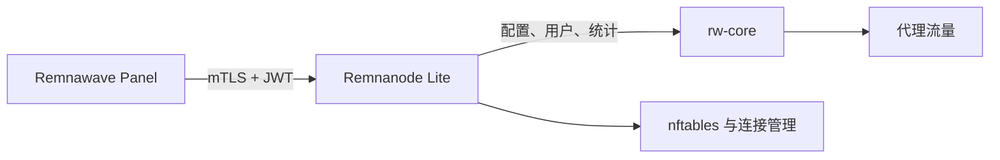

<!-- translation: locale=zh-CN; source=README.md; source-sha256=a3b25d081a9df7d06803f87f10022c8da66e40da17164aeb593a44a837b9ed2a -->
<div align="center">

# Remnanode Lite

**面向小型 Linux 服务器的 Remnawave Node Go 实现**

[English](README.md) | **简体中文** | [Русский](README.ru.md)

**英文 [README.md](README.md) 是权威版本，本页是中文说明。**

[](https://github.com/luxiaba/remnanode-lite/actions/workflows/ci.yml)
[](https://github.com/luxiaba/remnanode-lite/actions/workflows/container.yml)
[](https://github.com/luxiaba/remnanode-lite/actions/workflows/security.yml)
[](go.mod)
[](LICENSE)

[Docker 快速部署](#docker-快速部署) · [配置](docs/i18n/zh-CN/configuration.md) · [运维](docs/i18n/zh-CN/operations.md) · [完整文档](docs/i18n/zh-CN/README.md)

</div>

Remnanode Lite 是一个运行在 Linux 上的 Remnawave Node 实现。它接收 Remnawave Panel 下发的配置，管理 rw-core 进程、用户和插件规则，并上报系统与流量统计。Docker 镜像已经包含 rw-core 及其运行数据。

项目维护的部署配置面向**整机 512 MiB 内存、1 vCPU、2 GB 磁盘**的小型服务器，并提供 `linux/amd64` 和 `linux/arm64` 镜像。

> [!NOTE]
> Remnanode Lite 是独立维护的社区项目，与 Remnawave 官方没有隶属或背书关系。项目按照官方 Node 的公开行为保持兼容，代码则由我们独立开发和维护。

## 主要特点

- 实现 Remnawave Node `2.8.0` API 契约。
- 使用一个 Go 进程直接管理 rw-core，不依赖 Node.js 或 s6。
- 提供面向 512 MiB 服务器维护的低内存 Compose 配置。
- 支持用户热更新、统计、连接管理和官方插件规则格式。
- 提供 amd64/arm64 GHCR 镜像，并附带 SBOM、构建来源和证明。
- 只用一个 Compose 文件即可部署，不需要源码、`.env` 或持久化数据卷。

## Docker 快速部署

开始前需要准备 Docker Engine 和 Compose v2，并在 Remnawave Panel 中创建好节点，拿到该节点的完整 Secret Key。节点端口必须能被 Panel 访问。下面的命令默认在 root shell 中执行，其他情况请按需使用 `sudo`。

下载最新稳定版本附带的 Compose 文件：

```bash
mkdir -p /opt/remnanode
cd /opt/remnanode

curl -fL \
  https://github.com/luxiaba/remnanode-lite/releases/latest/download/docker-compose.single-file.yaml \
  -o docker-compose.yaml

chmod 600 docker-compose.yaml
```

下载到的文件已经固定到该 Release 的精确镜像版本。

打开 `docker-compose.yaml`，填写 Panel 中的节点端口和完整 Secret：

```yaml
environment:
  NODE_PORT: "38329"
  SECRET_KEY: "PASTE_THE_COMPLETE_PANEL_SECRET_KEY"
```

启动节点：

```bash
cd /opt/remnanode
docker compose config --quiet
docker compose pull
docker compose up -d --no-build
docker compose ps
docker compose logs --tail=100 remnanode
```

容器应先进入 healthy，随后节点应在 Panel 中恢复在线。最后再用真实代理流量确认部署结果；容器 healthy 本身并不能证明 Panel 连接和 rw-core 流量都正常。

从官方容器迁移时，原来的 `NODE_PORT` 和 `SECRET_KEY` 可以直接沿用；启动新容器前，请先停止旧容器。迁移、指定版本、digest 固定和回滚方法见 [Docker 部署指南](docs/i18n/zh-CN/deployment-docker.md)。

## 常用 Docker 环境变量

绝大多数节点只需要修改 `NODE_PORT` 和 `SECRET_KEY`。需要可选配置时，将它们添加到同一个 Compose `environment` 映射中。

| 变量 | 必需 | Release 附带 Compose 的设置 | 用途 |
| --- | --- | --- | --- |
| `NODE_PORT` | 是 | `38329` | Panel 连接节点的 HTTPS 端口，必须与 Panel 中的配置一致。 |
| `SECRET_KEY` | 是 | 占位符 | Panel 提供的完整 base64 或 base64url Secret。 |
| `LOW_MEMORY` | 否 | `1` | 启用小机器使用的低内存运行参数。 |
| `NODE_BIND_ADDR` | 否 | 未设置 | 只监听指定的本地地址；未设置时监听所有本地地址。 |
| `BODY_LIMIT_MB` | 否 | 自动 | 覆盖 Node 对外 API 的请求体上限；低内存模式会自动使用 16 MiB。 |
| `GOMEMLIMIT` | 否 | 自动 | 覆盖 Go 运行时内存软限制；低内存模式会自动使用 180 MiB。 |

请使用上面展示的 YAML 映射写法。不要写成 `- SECRET_KEY="..."`：在这种列表写法中，引号会成为值的一部分，导致 Secret 无法解码。Compose 文件中含有 Secret，Docker 本地元数据也能看到环境变量，因此文件权限应保持为 `0600`。

所有运行参数、取值范围和优先级见 [配置参考](docs/i18n/zh-CN/configuration.md)。

## 常用操作

查看 Node 日志：

```bash
docker compose logs --tail=100 -f remnanode
```

查看 rw-core 输出和错误日志：

```bash
docker exec -it remnanode tail -n 50 -F \
  /var/log/remnanode/xray.out.log \
  /var/log/remnanode/xray.err.log
```

查看当前运行版本：

```bash
docker exec remnanode remnanode-lite version
```

如果要切换精确版本，先修改 `image:`，然后拉取镜像并重建容器：

```bash
docker compose pull
docker compose up -d --no-build --force-recreate
```

`latest` 只会在主动 pull 时检查新镜像，不会自行替换正在运行的容器。rw-core 日志位于 tmpfs，重建容器后会清空；Node 日志由 Docker 按 Compose 中的限制轮转。健康检查、故障排查、分批更新和回滚见 [运维指南](docs/i18n/zh-CN/operations.md)。

## 版本与镜像标签

| 标签 | 用途 |
| --- | --- |
| `X.Y.Z` | 与对应官方 Node 契约对齐的稳定版本，推荐用于生产和回滚。 |
| `X.Y.Z-rnl.N` | Remnanode Lite 自己的迭代版本，可用于提前开发或继续完善已有对齐版本。 |
| `latest` | 最近一次完整发布的稳定版本。它会移动，不能作为回滚依据。 |
| `sha-<commit>` / `candidate-sha-<commit>` | 正式发布前测试某个 `main` 候选提交。 |
| `edge` | 当前 `main` 的滚动镜像，只适合短期测试。 |

批量部署应使用同一个精确版本或 manifest digest，并保留上一个值用于回滚。完整规则见 [版本与镜像标签](docs/i18n/zh-CN/versioning.md)。

## 兼容性

| 项目 | 当前基线 |
| --- | --- |
| Node 契约 | `2.8.0` |
| rw-core | `v26.6.27` |
| 平台 | `linux/amd64`、`linux/arm64` |
| 整机目标 | `512 MiB RAM / 1 vCPU / 2 GB disk` |
| Compose 服务限制 | `448 MiB RAM`，不额外使用 swap |

资源目标对应仓库维护的标准 Compose 配置，不表示任何流量和插件组合都一定适合相同规格。具体测量和边界见 [资源预算](docs/i18n/zh-CN/development/resource-budget.md)。

## 工作原理



Node 负责管理 rw-core 进程及其运行状态，Xray 配置始终以 Panel 下发的内容为准。因此，重建容器不需要配置数据卷，Panel 会重新下发配置。包结构、生命周期和数据流见 [架构与运行设计](docs/i18n/zh-CN/architecture.md)。

## 文档

| 目标 | 从这里开始 |
| --- | --- |
| 部署或迁移节点 | [Docker Compose](docs/i18n/zh-CN/deployment-docker.md) · [原生 Linux](docs/i18n/zh-CN/deployment-native.md) |
| 配置与日常运维 | [配置](docs/i18n/zh-CN/configuration.md) · [运维](docs/i18n/zh-CN/operations.md) |
| 了解项目实现 | [项目范围](docs/i18n/zh-CN/project.md) · [架构](docs/i18n/zh-CN/architecture.md) |
| 参与开发 | [开发指南](docs/i18n/zh-CN/development/README.md) · [测试](docs/i18n/zh-CN/development/testing.md) · [贡献说明](docs/i18n/zh-CN/contributing.md) |
| 了解版本和发布 | [版本策略](docs/i18n/zh-CN/versioning.md) · [发布流程](docs/i18n/zh-CN/release.md) |
| 报告或检查安全问题 | [安全策略](docs/i18n/zh-CN/security.md) |

[中文文档索引](docs/i18n/zh-CN/README.md)包含更完整的使用和开发资料。

## 开发

普通单元测试不需要 Panel、Secret 或正在运行的 rw-core：

```bash
git switch dev
go mod download
go test -count=1 ./...
mkdir -p bin
go build -trimpath -o bin/remnanode-lite ./cmd/remnanode-lite
./bin/remnanode-lite version
```

Linux 网络集成、真实 rw-core、Panel 兼容和正式发布验收属于不同的测试层。修改这些部分前，请先阅读 [开发指南](docs/i18n/zh-CN/development/README.md)。

## 安全

容器使用 host network 并持有 `NET_ADMIN`，因此能够修改宿主机的网络状态。只运行可信镜像，生产环境优先使用精确版本或 manifest digest。Compose 文件权限应保持为 `0600`，并限制对 Docker socket 和宿主机管理员账号的访问。

不要在公开 Issue 中发布 Secret、证书、真实节点信息或漏洞利用细节。私下报告方式见 [安全策略](docs/i18n/zh-CN/security.md)。

## 许可证

Remnanode Lite 使用 [AGPL-3.0-only](LICENSE) 许可证。
