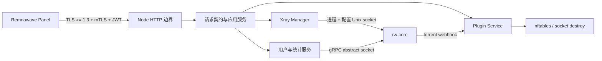

<!-- translation: locale=zh-CN; source=README.md; source-sha256=4803d9b11e8b118d4fba089408f1429349f9e687a7e9dd41bdfac800777ea377 -->

<div align="center">

# Remnanode Lite

**为资源受限 Linux 节点设计的 Remnawave Node Go 实现**

[English](README.md) | **简体中文** | [Русский](README.ru.md)

**本地化提示：英文是唯一权威来源；[查看英文原文](README.md)。**

[](https://github.com/luxiaba/remnanode-lite/actions/workflows/ci.yml)
[](https://github.com/luxiaba/remnanode-lite/actions/workflows/container.yml)
[](https://github.com/luxiaba/remnanode-lite/actions/workflows/security.yml)
[](go.mod)
[](LICENSE)

[文档](docs/i18n/zh-CN/README.md) · [Docker 部署](docs/i18n/zh-CN/deployment-docker.md) · [架构](docs/i18n/zh-CN/architecture.md) · [开发指南](docs/i18n/zh-CN/development/README.md) · [版本](docs/i18n/zh-CN/versioning.md) · [发布](docs/i18n/zh-CN/release.md)

</div>

> [!IMPORTANT]
> 本项目是独立维护的社区实现，与 Remnawave 官方项目没有隶属或背书关系。官方 `remnawave/node` 是外部行为和协议契约的参考，不是本仓库的代码上游。

Remnanode Lite 负责接收 Remnawave Panel 的节点指令，管理 rw-core 生命周期、用户热更新、统计和插件规则。它使用单个 Go Node 进程直接拥有 rw-core；Docker 镜像不依赖 Node.js、s6 或容器内第二个 supervisor，原生部署则由宿主 systemd/OpenRC 监督 Node。目标是在 **整机 512 MiB RAM / 1 vCPU / 2 GB 磁盘** 的小型 Linux 服务器上保持清晰、可控的运行边界。

## 为什么有这个项目

资源有限的边缘节点需要的不只是“能启动”：还需要与 Panel 行为兼容、进程与防火墙状态可恢复、输入与并发有界、升级能够回滚，并且代码能被长期维护。

本项目从一份社区 Go 实现的工程经验出发，重新审计并收敛了 API 契约、Xray 生命周期、插件事务、网络管理、安装供应链和低内存预算。最终目标不是逐行翻译官方 TypeScript，而是在保持外部兼容的前提下，建立一套适合 Go 的清晰架构。

| 关注点 | 当前设计 |
| --- | --- |
| Panel 兼容 | 固定官方源码证据，将 26 条 `/node` 路由、请求、响应与错误转换为可执行契约 |
| 资源边界 | `LOW_MEMORY=1`、有界请求/队列/并发、448 MiB cgroup；Docker 模板不创建持久日志卷 |
| 生命周期 | Node 是 rw-core 唯一所有者；显式状态机、operation/process epoch、进程 lease 和有界关闭 |
| 网络能力 | 私有 nftables 表、双栈 socket destroy，只保留 `NET_ADMIN` 与 `NET_BIND_SERVICE` |
| 交付 | amd64/arm64 GHCR 镜像、SBOM、provenance、build attestation 与校验过的原生安装资产 |

更完整的项目背景、目标与非目标见[项目说明](docs/i18n/zh-CN/project.md)。

## 当前状态

| 项目 | 当前值 |
| --- | --- |
| 项目版本 | `2.8.0`；正式可用性以不可变 Git tag 和 GitHub Release 为准 |
| 官方契约 | `remnawave/node 2.8.0@596f015a5c8f876dc9a9d61b6cb78d35bd8e379b` |
| 集成验收使用的 Panel 版本 | `2.8.1`；它不决定项目版本号 |
| rw-core | `v26.6.27` |
| 架构 | `linux/amd64`、`linux/arm64` |
| M7 原生工程快照 | Ubuntu 24.04 arm64/systemd；Alpine 3.22 arm64/OpenRC 容器（不是 M8 冻结候选验收） |
| 生产资源目标 | 整机 `512 MiB / 1 vCPU / 2 GB disk`，服务上限 `448 MiB`、无 swap |

静态契约和代码级整改已经完成，完整发布仍以冻结候选上的 Panel、双 init、双架构、资源、故障与 soak 验收为准。阶段状态见[路线图](docs/i18n/zh-CN/development/roadmap.md)，历史基准不等于正式版本的 SLA。

## 快速开始

生产推荐 Docker Compose。仓库提供一份完整的[单文件部署样本](deploy/compose.single-file.yaml)，无需源码或 `.env`。

在正式 Release 可用之前，或每次验收新候选时，先从 [GHCR Package](https://github.com/luxiaba/remnanode-lite/pkgs/container/remnanode-lite) 选择真实存在的 `sha-<40位提交>`，再用同一个提交下载 Compose，保证部署文件和镜像来自完全相同的代码：

```bash
(
  set -euo pipefail
  candidate_commit=REPLACE_WITH_40_CHAR_COMMIT
  candidate_tag="sha-${candidate_commit}"
  # 手动重建的候选使用 candidate-sha-${candidate_commit}。
  printf '%s\n' "$candidate_commit" | grep -Eq '^[0-9a-f]{40}$'

  mkdir -p /opt/remnanode
  cd /opt/remnanode
  curl -fL \
    "https://raw.githubusercontent.com/luxiaba/remnanode-lite/${candidate_commit}/deploy/compose.single-file.yaml" \
    -o docker-compose.yaml
  sed -i \
    "s|ghcr.io/luxiaba/remnanode-lite:latest|ghcr.io/luxiaba/remnanode-lite:${candidate_tag}|" \
    docker-compose.yaml
  chmod 600 docker-compose.yaml
)
```

正式版本发布后，GitHub Release 会附带已把镜像固定到该精确版本的同类文件和 `SHA256SUMS`；受控生产部署应优先下载与目标版本配套的 Release 资产。

下载完成后，`image:` 已固定到刚才选择的候选提交。启动前只需编辑节点端口和完整 Secret：

```yaml
environment:
  NODE_PORT: "38329"
  SECRET_KEY: "粘贴 Panel 提供的完整 base64 内容"
```

然后启动：

```bash
docker compose config --quiet
docker compose pull
docker compose up -d --no-build
docker compose ps
docker compose logs --tail=100 remnanode
```

> [!NOTE]
> `latest` 只在正式 Release 后存在并指向最新一个通过验证的稳定构建。`edge` 仅用于临时观察 `main`，不适合作为可回滚的生产版本。容器 healthy 只能证明内部 Unix socket 正在接受连接，不能证明 Panel 可达、mTLS/JWT 有效或 rw-core 已上线。

完整说明包括镜像标签、digest 固定、Secret 写法、日志、更新和回滚，见 [Docker Compose 部署](docs/i18n/zh-CN/deployment-docker.md)。原生 systemd/OpenRC 部署见[原生 Linux 部署](docs/i18n/zh-CN/deployment-native.md)。

## 运行架构



关键原则是“状态有唯一所有者”：HTTP 层只做认证、校验、容量控制和协调；业务服务不依赖 `net/http`；Xray Manager 独占进程、生命周期状态与 process lease；Plugin Service 独占插件快照和 nftables 事务。详细流程、锁序和包职责见[架构说明](docs/i18n/zh-CN/architecture.md)。

## 镜像标签

| 标签 | 含义 | 建议用途 |
| --- | --- | --- |
| `sha-<commit>` | 某个 `main` 提交的候选镜像 | 服务器验收；更强固定请记录 manifest digest |
| `candidate-sha-<commit>` | 从 `main` 手动触发的独立候选镜像 | 自动候选缺失或需要重建时定位候选 |
| `edge` | 当前 `main` 的浮动候选 | 临时观察，不用于稳定回滚 |
| `X.Y.Z-rnl.N` | 本项目独立迭代版本 | 精确部署和回滚 |
| `X.Y.Z` | 完成对应官方版本对齐后的正式版本 | 精确部署和回滚 |
| `latest` | 最新一个通过完整发布流程的稳定版本 | 主动跟随稳定版；运行容器不会自动更新 |

`rnl.N` 是本项目自己的迭代编号，可以用于提前开发下一条版本线，也可以用于继续完善某个官方版本；它不表示官方项目的修订次数。详见[版本模型](docs/i18n/zh-CN/versioning.md)。

## 文档导航

| 你想做什么 | 从这里开始 |
| --- | --- |
| 判断项目是否适合自己的节点 | [项目说明](docs/i18n/zh-CN/project.md) · [资源预算](docs/i18n/zh-CN/development/resource-budget.md) |
| 部署或迁移节点 | [Docker Compose](docs/i18n/zh-CN/deployment-docker.md) · [原生 Linux](docs/i18n/zh-CN/deployment-native.md) |
| 查配置、日志和故障 | [配置参考](docs/i18n/zh-CN/configuration.md) · [运维与排障](docs/i18n/zh-CN/operations.md) |
| 理解代码与数据流 | [架构说明](docs/i18n/zh-CN/architecture.md) · [2.8.0 契约基线](docs/i18n/zh-CN/development/contract-2.8.0.md) |
| 开始开发或提交修改 | [开发指南](docs/i18n/zh-CN/development/README.md) · [测试策略](docs/i18n/zh-CN/development/testing.md) · [贡献指南](docs/i18n/zh-CN/contributing.md) |
| 维护版本或发布 | [版本模型](docs/i18n/zh-CN/versioning.md) · [发布流程](docs/i18n/zh-CN/release.md) |
| 了解安全边界 | [安全策略](docs/i18n/zh-CN/security.md) |

完整文档地图和按角色阅读路径见[中文文档索引](docs/i18n/zh-CN/README.md)，本地化规则见[本地化说明](docs/i18n/README.md)。

## 开发

普通单元测试不需要 Panel、Secret 或 rw-core：

```bash
git switch dev
go mod download
go test -count=1 ./...
mkdir -p bin
go build -trimpath -o bin/remnanode-lite ./cmd/remnanode-lite
./bin/remnanode-lite version
```

Linux nftables、socket destroy、真实 rw-core、Panel 差分和发布验收属于独立测试层，不能由 macOS 上的 `go test ./...` 代替。修改前请阅读[开发指南](docs/i18n/zh-CN/development/README.md)和[测试策略](docs/i18n/zh-CN/development/testing.md)。

## 安全与信任边界

容器使用 host network，并持有 `NET_ADMIN`；这意味着它能影响宿主机网络命名空间。只运行受信任的镜像，并优先固定精确版本或 manifest digest。Docker 内联 Secret 会出现在本机 Docker 元数据中，因此部署文件应设置为 `0600`，并严格限制 Docker socket 与主机管理员权限。

发现漏洞时不要在公开 Issue 中披露利用细节、Secret、证书或真实节点信息。请遵循[中文安全策略](docs/i18n/zh-CN/security.md)中的私密报告流程。

## 许可证

本项目采用 [AGPL-3.0-only](LICENSE) 许可证。
