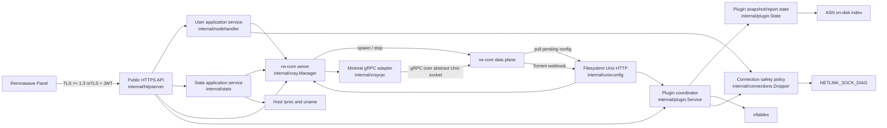
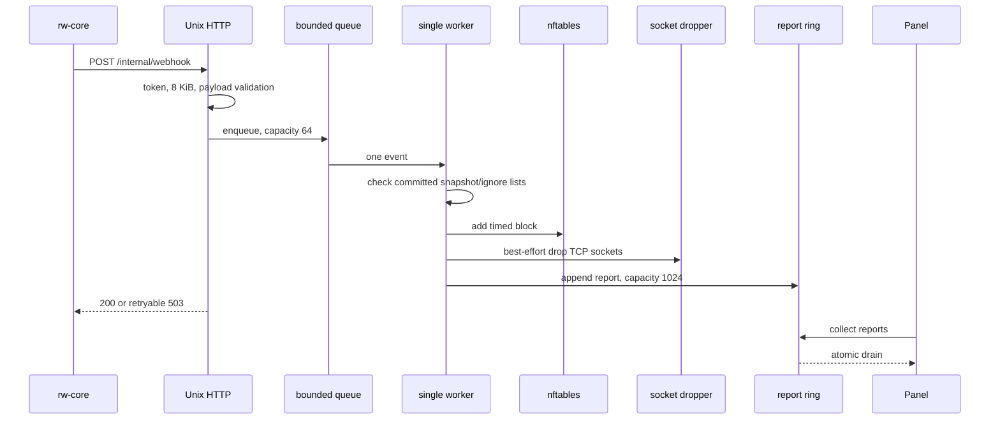
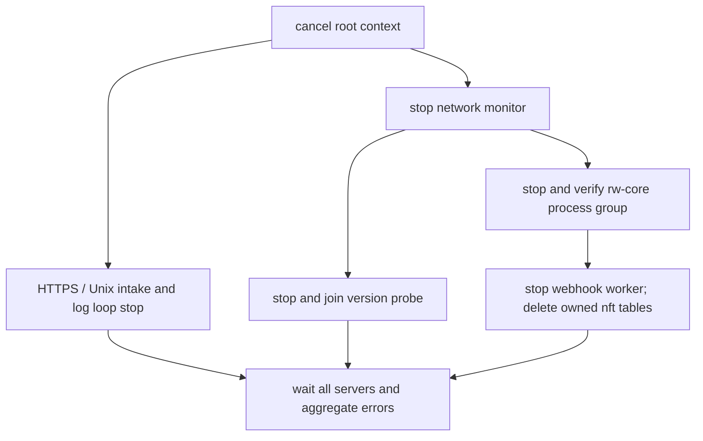

# Architecture and Runtime Design

[Documentation home](README.md) | [Development guide](development/README.md)

This document is for maintainers encountering Remnanode Lite for the first time. It describes the boundaries, runtime flows, state ownership, and resource constraints implemented by the current code. Its purpose is to explain how the system works and which invariants a code change must preserve. It is not a deployment reference or a release checklist for a particular version.

For deployment, see [Docker Compose](deployment-docker.md) or [Native Linux](deployment-native.md). For the route-by-route external API contract, see the [current official contract baseline](development/contract-2.8.0.md). For measured resource behavior, see the [512 MiB resource budget](development/resource-budget.md).

## 1. System Role

Remnanode Lite is a lightweight control plane between Remnawave Panel and rw-core. It does not forward proxy traffic itself. Its main responsibilities are:

- Receive Node API requests protected by mTLS and JWT from Panel.
- Validate requests and translate configuration, user, and statistics operations into process or gRPC operations understood by rw-core.
- Manage the rw-core child process, startup configuration, readiness state, and shutdown cleanup.
- Compile plugin configuration into nftables rules, and process Torrent webhooks and reports.
- Terminate selected TCP connections through Linux `NETLINK_SOCK_DIAG` when permitted.
- Keep requests, queues, logs, and concurrency bounded under a fixed resource budget.

The project follows the official Node's observable behavior and protocol contract, but not its internal TypeScript architecture. Four versions move independently: the project release, the official Node contract, the Panel used for integration verification, and rw-core. Their sources of truth are the version package, contract evidence, release documentation, and supply-chain pins.

The production targets are Linux `amd64` and `arm64` on a host constrained to `512 MiB RAM / 1 vCPU / 2 GB disk`. Build-tagged stubs for non-Linux systems keep the code buildable and unit tests runnable; they do not imply full production support on those systems.

## 2. System Overview



Control flow normally enters through Panel. Proxy data traffic is handled directly by rw-core on the host network. nftables changes and socket destruction are kernel side effects, available only on Linux with `CAP_NET_ADMIN`.

### 2.1 Deployment and Native lifecycle boundary

Docker and Native Linux deliver the same Node and pinned runtime assets, but their host lifecycle is different. A container is disposable: Compose selects one image and Panel repopulates runtime state after recreation. Native Linux uses `rnlctl` to select one verified generation under `/usr/local/lib/remnanode-lite` and records lifecycle state under `/var/lib/remnanode-lite-installer`.

`rnlctl` is a host administration process, not part of the resident Node. Its transaction engine verifies a complete release bundle, prepares the service definition, changes `current` and `previous` generation links, preserves enabled/running state, and commits only after the selected binary and private health socket pass. A durable journal makes an interrupted mutation visible to `status --json` and recoverable through `repair`. The independent `/usr/local/sbin/rnlctl` binary is never a symlink into the generation being repaired.

This delivery state is separate from the in-memory Xray lifecycle described below. Native generations persist software and service intent; they never persist the complete Panel-provided Xray configuration.

## 3. Packages and Dependency Direction

The composition root is [`cmd/remnanode-lite/main.go`](../cmd/remnanode-lite/main.go). It constructs concrete components and connects them through small interfaces. Runtime packages do not use a global service locator or dynamic plugin loading.

| Path | Primary responsibility |
| --- | --- |
| `cmd/remnanode-lite` | Production CLI, dependency assembly, daemon startup, and coordinated shutdown |
| `cmd/asn-builder` | Offline construction of the low-memory binary ASN index |
| `cmd/contract-probe` | Controlled black-box contract comparison between official and candidate Nodes |
| `cmd/rnlctl` | Native host administration CLI |
| `cmd/release-tool` | Deterministic runtime materialization, Native bundle/SBOM construction, and verification |
| `internal/config` | Bounded configuration reads, environment overrides, defaults, and Secret file reads |
| `internal/secret` | Decode Panel `SECRET_KEY` and extract the CA, JWT public key, and Node certificate/private key |
| `internal/auth` | RS256 JWT signature verification, `exp`/`nbf` checks, and optional identity-claim validation |
| `internal/httpserver` | Public TLS, route registration, authentication, admission control, DTO mapping, and response encoding |
| `internal/nodeapi` | Official request DTOs, JSON structural safeguards, Zod-compatible validation, and error models |
| `internal/nodehandler` | Application service for user add/remove, bulk mutations, and connection cleanup |
| `internal/stats` | Application response mapping for rw-core, plugin, and host statistics |
| `internal/xray` | rw-core aggregate root: process state machine, configuration injection, version, hashes, logs, and gRPC facade |
| `internal/xrayrpc` | Minimal gRPC wire adapter for rw-core |
| `internal/xrayrpc/wire` | Minimal protobuf messages used by the Node; `wire.pb.go` is generated |
| `internal/unixconfig` | Filesystem Unix socket HTTP service dedicated to rw-core |
| `internal/xraywebhook` | Strict, single-document JSON model for Torrent webhooks |
| `internal/plugin` | Plugin validation, plan/apply/commit coordination, nftables, and the bounded webhook worker |
| `internal/asn` | Read-only ASN-to-CIDR index using `ReadAt + binary search` |
| `internal/connections` | Connection-drop policy after allowlist and local-address protection |
| `internal/netadmin` | Linux capability detection and the `SOCK_DESTROY` kernel adapter |
| `internal/system` | Node.js-compatible host information and network-rate sampling |
| `internal/bodylimit` | Raw and decoded request-body limits, plus compression decoder admission |
| `internal/executil` | External command execution with context, bounded output, and reliable finalization |
| `internal/doctor` | Native-deployment checks for configuration, assets, capabilities, and tools |
| `internal/rnlctl` | Native generation, transaction journal, service-manager, repair, and uninstall engine |
| `internal/version` | Project release version and the contract version reported to Panel |
| `internal/contract` | Independent evidence model for the official contract; not part of the daemon runtime path |

The core dependency direction is:

```text
cmd/remnanode-lite
  -> version
  -> httpserver -> nodeapi
                -> nodehandler -> connections -> netadmin
                               -> xrayrpc
                -> stats       -> system
                               -> xrayrpc
                -> plugin      -> connections / xraywebhook
                -> xray
  -> unixconfig
  -> xray       -> xrayrpc / executil / system / netadmin
  -> config     -> secret
```

`nodehandler`, `stats`, and `plugin` define small interfaces on the consuming side. `xray.Manager`, `plugin.State`, and `connections.Dropper` implement those interfaces. This makes side effects replaceable for deterministic tests and prevents a package cycle between `xray` and `plugin`.

This is not a strict "pure domain layer" architecture. For example, `nodehandler` ports use value types from `xrayrpc`, `stats` assembles `system` data directly, and `httpserver` owns admission control and cross-component lifecycle coordination. Maintainers should reason from these actual capability boundaries rather than infer dependency layers from package names alone.

## 4. Startup Flow

The daemon entry point is `runNode`, which `main` calls when no CLI arguments are supplied. It immediately creates a root context for `SIGINT` and `SIGTERM`. All later initialization and background work derive their cancellation semantics from that context. The startup order deliberately surfaces configuration and security failures before opening listeners:

1. Parse runtime configuration.
   - An explicitly configured `REMNANODE_ENV` path has priority.
   - Otherwise, use `/etc/remnanode-lite/node.env` if it exists, then fall back to `.env`.
   - Load file values first, then override them with known, non-empty process environment variables.
2. Create the immutable request-body budget for the public `/node` server. Parsed contract and core version values remain in `Config` and are not written back to the process environment.
3. Apply the Go soft memory limit. An explicit `GOMEMLIMIT` takes precedence over the `180 MiB` default selected by `LOW_MEMORY=1`.
4. Check `CAP_NET_ADMIN`. Its absence emits a degradation warning but does not prevent the base Panel API from starting.
5. Parse the Node TLS material, client CA, and JWT public key from `SECRET_KEY`, then construct the JWT validator.
6. Create `plugin.State` and attempt to open the ASN database.
   - If the ASN file is absent or invalid, plugin `asList` resolution degrades to an empty result and the daemon continues starting.
7. Create `system.NetworkMonitor` and the shared `system.Collector`, then register monitor cleanup immediately.
8. Create `xray.Manager`.
   - Generate a process-unique rw-core gRPC abstract socket name.
   - Inject frozen Node/core versions, the shared Collector, and the Torrent configuration provider.
   - Attempt to probe the rw-core version. On failure, keep it unknown; later health calls may retry with throttling.
9. Create `connections.Dropper` and `plugin.Service`.
   - The single Plugin webhook worker starts in the Service constructor.
   - nftables initialization uses the root context. Failure is a supported degraded mode, while startup cancellation returns immediately.
10. Create `stats.Service` and `nodehandler.Service`, then pass the assembled dependencies to `httpserver.New`.
11. Create the public HTTPS server and the filesystem Unix HTTP server. The public server validates the Node certificate/private key and builds the client CA pool at this point.
12. Start public HTTPS, internal Unix HTTP, and log rotation concurrently. Wait for root-context cancellation or an unexpected exit from either server.

`internal/system` starts neither a default monitor nor a goroutine during package initialization. The composition root creates the only `NetworkMonitor`, shares its `Collector` with Xray and stats, and stops the poller during shutdown. Each closeable component registers cleanup as soon as it is created, so a later startup failure cannot leave earlier resources running.

## 5. Panel Request Flow

### 5.1 Public Request Chain

The public server exposes exactly 26 fixed `/node/*` routes. Requests pass through the following sequence:

```text
TLS >= 1.3 mTLS handshake
  -> reject non-/node paths
  -> validate RS256 Bearer JWT
  -> require an exact known method + path
  -> attach 5 minute request deadline
  -> bulk route admission (1)
  -> Xray start admission (2)
  -> active handler admission (32, LOW_MEMORY 4)
  -> attach route-specific body limit
  -> decompress with bounded decoder capacity
  -> limit decoded/transcoded body again
  -> parse charset and exactly one JSON document
  -> DTO validation
  -> dispatcher
  -> application service / runtime coordinator
```

TLS requires version 1.3 or later and a client certificate signed by the CA embedded in the Secret. Go's automatic HTTP/2 negotiation is disabled. For compatibility with the official Node, an invalid JWT, unknown path, or wrong method closes the connection instead of returning a conventional 401/404/405 response.

The requests fall into four groups:

- Xray: start, stop, and healthcheck, for 3 routes.
- Stats: user online state, traffic, system, and IP statistics, for 10 routes.
- Handler: hot user updates and connection termination, for 8 routes.
- Plugin: synchronization, report collection, and nftables operations, for 5 routes.

The authoritative registry is [`internal/httpserver/node_routes.go`](../internal/httpserver/node_routes.go). Do not maintain a second runtime route registry elsewhere when adding or changing routes.

### 5.2 Request Resources and JSON Boundaries

Per-route body limits are:

| Class | Limit | Typical routes |
| --- | ---: | --- |
| small | `64 KiB` | Queries, stop, health, and remove user |
| medium | `256 KiB` | Add user and block/unblock IP |
| bulk | `16 MiB` | Xray start, bulk users, bulk connections, and plugin sync |

`BODY_LIMIT_MB` is an additional ceiling for the public `/node` HTTPS server. The effective value is the smaller of the server configuration and the route-specific limit. Consequently, the current public API never accepts a request larger than `16 MiB`, even in normal mode. With `LOW_MEMORY=1`, the server default is `16 MiB` and an explicitly larger value causes startup to fail. The internal Unix webhook does not read this setting and always uses `8 KiB`.

Supported content encodings are `gzip`, `deflate`, `br`, and `zstd`. At most two decoders may run concurrently. zstd uses one thread, low-memory mode, and a bounded window. The wire body, decompressed result, and charset-transcoded result are all bounded again, so compression ratio cannot bypass the budget.

The JSON DTO boundary has these properties:

- It parses exactly one top-level object or array and rejects a trailing second document.
- Unknown fields in official Zod objects are ignored for compatibility.
- It rejects duplicate keys, case-only shadow keys, nesting deeper than 64 levels, overlong keys, and tokens or collections that exceed their budgets.
- It accepts UTF-8 with or without BOM and UTF-16 LE/BE. It does not accept arbitrary `application/*+json` media types.
- It returns at most 64 validation issues and bounds error text, paths, and option lists.

Six routes without DTOs permit an empty body. If a caller sends an `application/json` body, it must still be one valid object or array. These routes must not be described as ignoring any arbitrary body.

### 5.3 Responses and Errors

- Successful results consistently use HTTP 200 with a `{ "response": ... }` envelope.
- DTO validation normally returns 400, oversized requests return 413, and unsupported charsets or encodings return 415.
- A timeout while waiting for admission or a lifecycle lease returns 503 with `Retry-After: 1` and closes the connection. Client cancellation stops processing directly.
- Stats and query application errors use `A010` through `A017`. Unclassified errors are logged and mapped to `E000`.
- An Xray start business failure appears inside an HTTP 200 response as `isStarted=false/error`.
- Partial failure during bulk user operations appears inside an HTTP 200 response as `success=false/error`. The sequence of gRPC calls is not a database transaction.
- Plugin operations use `accepted` to express the protocol result. It is not always synonymous with successful completion of every optional host-side effect.

### 5.4 User and Statistics Data Flow

`nodehandler.Service` serializes add/remove mutations through a cancelable gate with capacity 1. Each top-level operation acquires one Manager process lease and uses its context for inbound and IP queries, Handler RPCs, connection cleanup, and the local user-hash commit. The lease belongs to a specific `process epoch + abstract socket`, so `Start` and `Stop` wait for the whole mutation to finish. A released token, or one issued by another Manager, is rejected.

Earlier RPCs in a bulk user operation may already have succeeded; the implementation does not pretend to roll them back. Its guarantees are that the local hash never advances beyond rw-core, that the first explicit error is returned, and that Panel can retry safely.

Before deleting a user, the service retrieves that user's online IPs with `reset=false`. It drops connections only after the relevant inbound removal succeeds. The connection layer normalizes and deduplicates addresses, applies the allowlist, and rejects local, loopback, link-local, multicast, unspecified, scoped, and IPv4 broadcast addresses.

`stats.Service` is a response-mapping layer. Its underlying data comes from three sources:

- rw-core Stats gRPC for traffic, online state, IPs, and runtime statistics.
- `plugin.Service` for the number of pending Torrent reports.
- `internal/system` for `uname`, `/proc/meminfo`, `/proc/loadavg`, `/proc/uptime`, `/proc/cpuinfo`, and the default-interface rate.

The Manager creates a short-lived gRPC client for each Handler or Stats operation and closes it when the call completes. Ordinary RPCs default to 5 seconds, Ping to 3 seconds, and the receive-message limit is `16 MiB`. The all-user IP path prefers the rw-core extension RPC. After an `Unimplemented` response, it caches legacy capability and queries per-user IPs with at most 8 workers.

User and tag statistics aggregated from maps have no stable ordering guarantee. Callers must not rely on their order.

## 6. Two Unix Channels

The code has two Unix channels with different purposes and security boundaries. Documentation and logs must distinguish them accurately.

| Channel | Default identifier | Owner and protocol | Purpose | Security boundary |
| --- | --- | --- | --- | --- |
| Filesystem Unix socket | `/run/remnanode/internal.sock` | Node serves HTTP; rw-core is the client | Retrieve pending configuration; deliver Torrent webhooks | File mode `0600`, stable-file checks, internal token |
| Linux abstract Unix socket | `@remnanode-xtls-<16hex>` | rw-core serves gRPC; Node is the client | Handler and Stats RPCs; readiness Ping | Same network namespace, random name, no internal TLS |

### 6.1 Filesystem Unix HTTP

[`internal/unixconfig/server.go`](../internal/unixconfig/server.go) serves:

- `GET /internal/get-config`
- `POST /internal/webhook`

The server refuses to replace a symlink, regular file, or socket that is still listening. It removes a stale socket only after its identity has been checked both before and after the decision. A non-blocking `flock` on the directory prevents two Nodes from owning the same path, and a new socket is set to mode `0600`.

The connection limit is 8 and the active-handler limit is 4. Webhooks may use at most 3 of those handler slots, preserving capacity for rw-core to retrieve its startup configuration. Headers are limited to `8 KiB`, the request deadline is 30 seconds, and webhook bodies are limited to `8 KiB`.

Internal authentication prefers `X-Internal-Token`. A query token exists only for compatibility with the legacy path. If a request supplies no token, access relies on owner-only socket permissions. When `INTERNAL_REST_TOKEN` is not configured, the Node generates a URL-safe token from 48 random bytes on every start.

### 6.2 Abstract gRPC

The Manager constructor generates a random abstract socket prefix. Each rw-core process appends its own epoch, and the resulting name is injected into the tunnel inbound. This prevents a delayed gRPC client from an old process from reaching its replacement. `internal/xrayrpc` calls explicit method paths through `grpc.ClientConnInterface.Invoke`, without depending on the full Xray Go SDK.

The channel uses insecure gRPC transport because it is not a public TCP boundary. However, an abstract socket is not private to the current process; it is accessible within the same network namespace. The random name reduces discoverability, while container or host namespace isolation remains part of the security model.

[`internal/xrayrpc/wire/wire.proto`](../internal/xrayrpc/wire/wire.proto) declares only the fields actually used by the Node. Field numbers and wire types must match rw-core. `wire.pb.go` is generated and must not be edited manually. Method paths, TypedMessage type names, and golden wire bytes are fixed by `internal/xrayrpc/wire_golden_test.go`.

## 7. Xray Start Flow

### 7.1 State Machine and Ownership

`xray.Manager` is the sole owner of the rw-core process:

```mermaid
stateDiagram-v2
    [*] --> stopped
    stopped --> starting: accepted start
    running --> starting: restart required
    starting --> running: gRPC ready and process alive
    starting --> stopped: failure and cleanup complete
    starting --> stopping: stop cancels start
    running --> stopping: stop
    running --> stopped: natural exit and cleanup complete
    stopping --> stopped: process group cleanup verified
    stopping --> stopping: cleanup failed; later stop retries
```



The core synchronization fields are:

- `Manager.mu` protects state, operation and process epochs, the process, pending configuration, hashes, inbound tags, and version.
- `Manager.lifecycleMu` represents long-held process lifecycle ownership. Only one Start/Stop owner may hold it at a time.
- `processState.mutationGate` binds accepted user and stats mutations to the current process. A lifecycle writer waits for them before replacing or terminating that process.
- `processState.finalizeMu` prevents signal, kill, Wait, and process-group cleanup from running in duplicate or in parallel.
- `operationEpoch` identifies the current Start/Stop owner. `process.epoch + socket` identifies the actual rw-core instance. The two identities are not interchangeable.

The HTTP layer adds an `xrayLifecycleGate`:

- Start takes a shared lease, with at most two admitted requests, so the second request can receive the officially compatible `Request already in progress` result.
- Stop, plugin sync/recreate, user mutations, and stats operations with reset take an exclusive lease.
- A waiting exclusive request prevents later starts from cutting ahead of it.

These two layers have different responsibilities: the HTTP gate coordinates cross-component operations, while Manager locks preserve actual process ownership.

### 7.2 Detailed Startup Sequence

```mermaid
sequenceDiagram
    participant P as Panel
    participant H as httpserver
    participant M as xray.Manager
    participant U as Unix HTTP
    participant C as rw-core
    participant G as abstract gRPC

    P->>H: POST /node/xray/start
    H->>H: auth, limits, DTO validation
    H->>M: Start(config, hashes)
    M->>M: compare current hashes
    alt running and unchanged
        M-->>H: isStarted=true, no process replacement
    else restart required
        M->>M: inject API/stats/policy/plugin config
        M->>M: serialize bounded pending JSON
        M->>C: stop prior owned process group
        M->>C: spawn rw-core with http+unix config URL
        C->>U: GET /internal/get-config
        U->>M: CurrentConfigJSON
        M-->>C: pending JSON
        M->>G: Ping until ready
        G-->>M: ready
        M->>M: commit running/hash/version; release full JSON
        M-->>H: isStarted=true
    end
    H-->>P: HTTP 200 response envelope
```

The concrete steps are:

1. Reject a concurrent request while the Manager is starting or stopping, or while an unclean process retained by an earlier cleanup failure still exists.
2. If the core is running, force restart is false, and hash checks are enabled, Ping gRPC in real time before comparing the base hash, inbound set, and user `HashedSet`. Reuse the current process when all values match.
3. Take ownership of `xrayConfig` from the request in place to avoid cloning the complete large configuration.
4. Override or inject stats, API, policy, the abstract tunnel inbound, and the API routing rule.
5. Inject the Torrent blackhole outbound, routing rule, and webhook according to the committed and valid Plugin snapshot.
6. Build compact hash state, then serialize the final configuration as canonical JSON bounded to `20 MiB` and 128 levels.
7. Stop the previous process and verify its cleanup.
8. Store the JSON in `pendingConfigJSON` and start rw-core:

   ```text
   rw-core -config http+unix://<filesystem-socket>/internal/get-config -format json
   ```

9. Wait for abstract gRPC readiness. The default is 20 seconds in normal mode and 90 seconds with `LOW_MEMORY=1`, probing every 2 seconds.
10. Verify that the current operation still owns the process epoch and that the process has not exited, probe the core version, and atomically publish running state, hash state, and version.
11. Release the complete JSON immediately, retaining only compact hashes and inbound tags.

`CurrentConfigJSON()` is not a runtime dump-config endpoint. It returns pending JSON only during startup and returns `{}` after rw-core becomes ready. After a Node restart, it also does not restore an old Panel configuration from disk; it waits for Panel to send a new start request.

`Health()` is likewise not a live gRPC probe. `IsAlive` means the Node process is responding, while `XrayInternalStatusCached` comes from the local lifecycle cache. Code that needs to determine whether rw-core is actually ready must use the start/readiness path rather than extend the existing health contract semantics.

### 7.3 Child Process and Secret Boundary

On Linux, rw-core runs in its own process group with `Pdeathsig=SIGKILL`. Shutdown sends SIGINT to the entire group, waits 5 seconds by default, sends SIGKILL, and waits another 5 seconds. The implementation deliberately does not reap an exited leader PID immediately. It first scans `/proc` to verify that no non-leader descendants remain alive, then performs exactly one `Wait`. This avoids harming another process group after PID reuse.

`rwCoreEnvironment` explicitly sanitizes the rw-core child environment:

- Remove `SECRET_KEY`, `SECRET_KEY_FILE`, `INTERNAL_REST_TOKEN`, and `REMNANODE_ENV`.
- Remove any caller-provided asset path and rw-core internal token before writing the controlled values for this invocation.
- Preserve other unmanaged environment variables, while overriding `XRAY_LOCATION_ASSET` and `RNL_INTERNAL_REST_TOKEN` with controlled values.

The Panel TLS private key, CA, and JWT public key therefore remain only in the Go Node process and are not propagated to rw-core as environment variables. The internal token is an intentional exception passed to rw-core for filesystem Unix HTTP and webhook coordination.

`Pdeathsig` applies directly only to the leader. If the Node or its outer supervisor is force-killed, not every descendant is guaranteed to be reaped automatically. The recovery strategy remains restarting the service or host, or recreating the container.

## 8. Plugin Sync and Webhook Flow

### 8.1 State and Plan/Apply/Commit

`plugin.Service` coordinates side-effect transactions, while `plugin.State` publishes read-only state. Once published, a `pluginSnapshot` is immutable and stores only:

- The original source hash and the official object-hash-compatible configuration hash.
- Plugin UUID and name.
- Firewall readiness.
- The connection-drop allowlist matcher.
- Derived Torrent settings.
- The static firewall plan.

The complete plugin JSON is not retained long term. A sync follows these main steps:

1. Acquire the cancelable Plugin operation lease with capacity 1.
2. For an identical source hash and identical firewall readiness, take the fast path and update identity only.
3. Otherwise, validate the JSON, schema, collections, and resource budgets before any side effect.
4. Expand shared IP lists and ASN lists into an immutable plan.
5. If behavior is equivalent to the current state, publish only the new snapshot and preserve dynamic Torrent blocks.
6. If behavior changes, coordinate nftables and Xray in the required order.
7. Commit the snapshot only after both sides succeed. A rollback-capable failure replays the previous static firewall plan.

Ordinary enable and update operations normally apply the firewall first, then coordinate Xray. Disabling Torrent, cleanup, or a destructive reset coordinates or stops Xray first and then resets the firewall, preventing a running core from temporarily losing filtering.

Enabling or disabling Torrent, or changing `includeRuleTags`, may invoke `StopIfOnline`. It stops rw-core but does not restart it automatically. A later start comes from Panel's normal synchronization flow. Disabling Torrent without include tags can hot-remove the dedicated outbound through Handler gRPC.

An invalid plugin configuration does not simply leave the previous configuration in place. The Service attempts to stop Xray, clear the Plugin snapshot, and reset the firewall while preserving reports not yet collected by Panel.

When `CAP_NET_ADMIN` is absent or nft initialization fails, valid configuration may still be accepted as a degraded snapshot under official semantics, but nft filtering and the effective Torrent blocker remain disabled. Documentation must not equate `accepted=true` with every optional host-side feature having taken effect.

### 8.2 nftables Ownership

The Linux backend manages fixed tables:

- IPv4: `remnanode`
- IPv6: `remnanode6`

Each family contains Torrent, ingress, and egress IP sets, plus an egress port set. Input and forward filter on source IP; output filters on destination IP or TCP/UDP destination port. Chain policy remains accept.

- `Apply` replaces only static sets and preserves dynamic Torrent elements.
- `Reset` recreates the dual-stack tables and replays the static plan, clearing dynamic Torrent elements.
- `BlockIPs` uses a batched dual-stack transaction.
- `UnblockIPs` separates operations by address and set so one missing element cannot roll back other deletions.
- `RecreateTables` uses Reset, so it does not preserve dynamic timed blocks and replays only the committed static plan.
- `Close` deletes only tables that the current process believes it owns.

Table names are not unique per instance. Only one Remnanode Lite instance is supported in a network namespace. Multiple instances using host networking compete for the same nftables tables.

### 8.3 Torrent Webhook



A webhook must provide an email and source. IP addresses are normalized, and scoped, unspecified, loopback, multicast, link-local, and IPv4 broadcast addresses are rejected. Ignored users, IPs, and CIDRs do not produce a block.

A malformed webhook payload is logged with bounded detail and returns 200 to preserve current compatibility semantics. The server returns a retryable 503 only when the bounded queue does not accept the request.

When the queue is full, the request waits for capacity within its 30-second context instead of growing without bound or being dropped silently. Service shutdown, request cancellation, or capacity remaining unavailable returns 503. The single worker acquires the same operation gate as sync, block, and unblock, serializing Plugin side effects.

Reports use a chronological ring buffer with a maximum of 1024 entries. At capacity, it overwrites the oldest record and increments a dropped counter; Panel collection drains the ring atomically. After an nft block succeeds, the report is marked blocked. The later socket drop is best effort, and its failure does not retroactively change `accepted` or blocked state.

Connection termination targets only connected TCP sockets. It does not support UDP, LISTEN, or TIME_WAIT. `netadmin` performs one streaming socket dump for IPv6 and another for IPv4, validates every `SOCK_DESTROY` acknowledgment, and treats `ENOENT` as idempotent success.

## 9. Shutdown Flow

After a signal or server failure cancels the root context, all application cleanup shares one 25-second deadline. The budget is not restarted for each component.



Shutdown follows these rules:

- The network monitor receives its stop signal first.
- The Manager's background version recovery shuts down in parallel with application cleanup.
- Application ordering is fixed as `stop rw-core -> close Plugin/nft`, retaining filtering until the core is confirmed stopped.
- If rw-core or Plugin immediately returns a transient cleanup error, cleanup waits 100 ms and retries once within the same deadline.
- HTTPS attempts graceful shutdown and force-closes on failure.
- After root-context cancellation, the Unix server uses its own shutdown budget of at most 5 seconds. Plugin cleanup may use at most 15 seconds of the remaining budget by default.
- A WaitGroup joins HTTPS, the Unix server, and log rotation. All errors are aggregated with `errors.Join`.

The outer systemd or Compose stop grace must exceed the application's 25-second budget, leaving time for runtime force termination and container finalization. A clean application return does not promise persistent transaction recovery after power loss, `SIGKILL`, or a supervisor crash.

## 10. State Ownership and Persistence

| State | Sole owner | Synchronization | Lifetime |
| --- | --- | --- | --- |
| rw-core process/state/epochs | `xray.Manager` | `mu` + `lifecycleMu` + process mutation gate | Node process |
| Pending Xray JSON | `xray.Manager` | `mu` | Start through gRPC readiness only |
| Inbound tags/user hash | `xray.Manager` | `mu` + process lease identity | Current rw-core process epoch |
| rw-core version and stats capability | `xray.Manager` | Mutex / atomic | Node process |
| Committed Plugin snapshot | `plugin.State` | RWMutex; immutable after publication | Node process |
| Torrent report ring | `plugin.State` | RWMutex | Node process; cleared after collection |
| Plugin mutation/worker lifecycle | `plugin.Service` | Channel gate, atomic fence, stop channels | Node process |
| User mutation serialization | `nodehandler.Service` | Capacity-1 channel gate | Node process |
| Host network sample | `system.NetworkMonitor` | RWMutex + 3-second poller | Node process |
| ASN prefix data | `asn.DB` | Read-only file + `ReadAt` | Read-only on-disk asset |
| nftables rules | Linux kernel | Plugin transaction + backend mutex | Network namespace |
| rw-core logs | Capped writers / periodic rotation | Writer mutex / rotation mutex | `LOG_DIR`, normally tmpfs in a container |
| Native selected generations | `rnlctl` | Process lock + durable journal + atomic files/symlinks | Across host restarts until upgrade/uninstall |
| Native service intent and account ownership | `rnlctl` | Strict JSON state committed after service verification | Across host restarts until uninstall/purge |

The Node does not persist the complete Xray configuration received from Panel, the Plugin snapshot, user hashes, or Torrent reports. Correct recovery after a process restart comes from Panel synchronizing state again, not from reading stale local state.

Native lifecycle state records release identity, generation selection, service intent, repair cache identity, and whether the installer created the service account. It contains no Panel Secret and no active Xray configuration. `/etc/remnanode-lite/secret.key` is a separate root-managed file.

The ASN database uses the custom little-endian `RWASNDB\x01` format. It reads a matching ASN's prefix blob only when needed, without using mmap or loading the whole database into memory. Startup checks only the header and magic. Corruption elsewhere in the file normally appears as an empty lookup result, so startup is not a full-database validation.

## 11. Concurrency and Resource Boundaries

Every high-risk resource must have an explicit bound. The principal current budgets are:

| Resource | Normal mode | `LOW_MEMORY=1` / fixed value |
| --- | ---: | ---: |
| Public TCP connections | 128 | 16 |
| Active HTTP handlers | 32 | 4 |
| Non-start bulk handlers | 1 | 1 |
| Concurrent admitted starts | 2 | 2 |
| Compression decoders | 2 | 2 |
| Public route body | At most 16 MiB | At most 16 MiB |
| Prepared rw-core JSON | 20 MiB / 128 levels | Same |
| gRPC receive message | 16 MiB | Same |
| Unix connections / handlers | 8 / 4 | Same |
| Unix webhook handlers | At most 3 | Same |
| Plugin configuration | 2 MiB | Same |
| Plugin mutation | 1 | Same |
| Webhook queue / workers | 64 / 1 | Same |
| Torrent reports | 1024 | Same |
| Resolved Plugin IP items | 32768 | Same |
| Dynamic nft elements per family | 16384 | Same |
| NFT block / unblock batch | 1024 / 128 | Same |
| Legacy IP lookup workers | 8 | Same |
| Per rw-core/OpenRC log threshold | 4 MiB + one `.1` file | Same |
| Go soft memory limit | Runtime default | 180 MiB by default |

The public handler's priority-based capacity classes reserve at least one total handler slot for mutations. `nodeRouteIsReadOnly` is an admission-classification name in the code, but some stats DTOs in that class still allow `reset=true`. Do not interpret the name as a strict side-effect-free safety property.

The cross-component lock order is:

```text
HTTP Xray lifecycle lease -> Plugin operation gate / nodehandler mutation gate -> xray process lease -> Manager state
```

At the HTTP boundary, start takes a shared lease. Stop, Plugin mutations, user mutations, and stats operations with reset take an exclusive lease. The user service also holds a process lease for the current rw-core `process epoch + abstract socket` while it runs RPCs, queries IPs, cleans up connections, and commits the local hash. `Start` and `Stop` wait for that lease before replacing or terminating the process.

`operationEpoch` identifies lifecycle-operation ownership; it is not a process identity. Any future internal mutation path that bypasses HTTP must reuse the Manager process lease instead of composing several RPCs under a new lock order.

## 12. Security Boundaries

### 12.1 External Trust Boundary

- The public API may bind all addresses by default. Deployment firewall policy controls the exposed port range.
- mTLS proves that the client certificate was signed by the CA in the Panel Secret.
- JWT accepts only RS256, verifies the signature, and validates `exp` and `nbf` when those claims are present.
- The current daemon uses empty issuer, audience, and subject expectations. Documentation must not claim that those claims are enforced.
- Invalid authentication and unknown routes close the connection directly, reducing the enumerable API surface.

### 12.2 Secret and File Boundary

- `SECRET_KEY` has a maximum encoded length of 256 KiB and accepts padded or raw standard and URL-safe base64 forms.
- Secret JSON must be exactly one object, reject duplicate fields, and contain the CA, JWT public key, Node certificate, and private key.
- The `SECRET_KEY` environment value takes precedence over `SECRET_KEY_FILE`.
- Configuration and Secret files must be stable, regular, non-symlink files. Linux and macOS use `O_NOFOLLOW|O_NONBLOCK|O_CLOEXEC` and verify identity, size, and mtime on the same file descriptor before and after reading.
- As described in section 7.3, the rw-core environment removes known Node secrets and overrides the controlled internal token and asset path. Other unmanaged environment variables are still inherited.

### 12.3 Kernel Capability Boundary

`CAP_NET_ADMIN` is required for nftables and socket destruction. Without it:

- The Node API, mTLS, Xray lifecycle, and capabilities that do not depend on nft can still run.
- The Plugin firewall enters a degraded or unavailable state.
- Connection termination fails or is mapped by the upper layer according to the contract.

The Node owns only its fixed project tables and the rw-core process group it created. It must not modify generic host Xray paths or other nftables tables.

Socket destruction matches connected TCP sockets in the same network namespace by local or remote IP, not by PID. On a shared host, it may therefore close another process's sockets. Panel business paths reject local and special addresses first, but the administrative command `remnanode-lite kill-sockets` bypasses that protection. Use a dedicated node network environment in production, and never run this command against a host-local IP. Whether a low-numbered listener needs `CAP_NET_BIND_SERVICE` depends on the deployment port.

## 13. Where to Start When Changing Code

### Add or Change a Public Route

1. Update the sole registry in `internal/httpserver/node_routes.go`, including its body and admission classifications.
2. Define DTOs, structural schemas, and validation semantics in `internal/nodeapi`.
3. Keep `httpserver` limited to decoding, mapping, and response adaptation. Do not carry HTTP types into application services.
4. Implement business behavior in `nodehandler`, `stats`, `plugin`, or `xray`.
5. Synchronize the routes, schemas, valid examples, and side effects in `internal/contract`. Rebuild the source manifest from the pinned official Git object with `contract-source-check -write`, then review the content-digest and machine-extracted route diff.
6. Add tests proving that invalid input causes no side effects and tests for the real dispatcher response schema.

### Change the Xray Lifecycle

- Keep `Manager` as the sole process owner.
- Before committing any asynchronous lifecycle result, verify the operation epoch, process identity, and state.
- Publish running state only when gRPC is ready and the process is still alive.
- A startup failure must reap the spawned process and establish either stopped state or a retryable stopping state explicitly.
- Do not retain a second complete configuration after readiness.
- Cover concurrent starts, start/stop interleavings, cancellation, timeout, natural exit, and cleanup retries.

### Change Plugin or nftables Behavior

- Follow `validate/build plan -> apply side effects -> commit immutable snapshot`.
- Complete collection and expansion budget validation before any side effect.
- State whether the operation uses Apply or destructive Reset, and whether dynamic Torrent elements survive.
- Preserve the safe order between stopping the core and deleting firewall state.
- Update unit tests and Linux network-namespace integration tests together.

### Change the gRPC Wire Contract

- Base changes to `wire.proto` or explicit constants on the actual rw-core field numbers and method paths.
- Run `scripts/generate-protobuf.sh` to regenerate `wire.pb.go` with pinned `protoc 35.1` and `protoc-gen-go v1.36.11`. Never edit the generated file manually.
- Update wire golden tests, Handler and Stats tests, and the real rw-core integration test.
- Before committing, run `scripts/generate-protobuf.sh --check` and verify byte-for-byte agreement between generated code and the schema.

### Change a Linux-Specific Capability

- Implement the Linux behavior in files with the appropriate build tag.
- Provide a clear failure or degraded non-Linux stub so the package remains buildable.
- Do not describe the existence of a stub as production support for that platform.
- For nft, netlink, or process-group changes, use an isolated namespace or a real-process test.

## 14. Tests and Sources of Truth

Architecture constraints are primarily enforced by executable tests, not asserted by documentation:

- Regular: `go test ./...`
- Concurrency: `go test -race ./...`
- Static: `go vet ./...`, `gofmt`, and `go mod tidy -diff`
- Official source evidence: `go run ./cmd/contract-source-check -source <official-git-repository>`
- nftables integration: `REMNANODE_NFT_INTEGRATION=1`
- Socket-destroy integration: `REMNANODE_SOCKET_KILL_INTEGRATION=1`
- Real core under low memory: `scripts/test-low-memory.sh`

`internal/contract` is a hand-maintained, executable subset of the official Zod contract; it is not generated from the TypeScript schemas. The source manifest records a SHA-256 for every evidence blob at the pinned commit.

A deliberately narrow extractor disables Git replace refs and independently reads the official `REST_API`, global prefix, and controller decorators. Against the Git tree, it also verifies the actual bootstrap, static imports, strict module metadata, controller and decorator ownership, registration reachability, and internal prefix exclusions. Unsupported TypeScript syntax fails closed. This keeps a hand-written route table or permissive token scan from validating itself, but it is not a complete Zod translator. Use `cmd/contract-probe` when two running instances need a controlled black-box comparison.

Use the following files as sources of truth when inspecting or changing behavior:

| Question | Source of truth |
| --- | --- |
| Actual public methods and paths | `internal/httpserver/node_routes.go` |
| Official compatibility target and response schemas | `internal/contract` + source manifest + pinned official Git object |
| Request DTOs and validation errors | `internal/nodeapi` |
| Configuration keys, defaults, and precedence | `internal/config/config.go` |
| Xray state machine and process semantics | `internal/xray/lifecycle.go` and `process_linux.go` |
| Plugin transactions and state | `internal/plugin/service.go` and `state.go` |
| Hard resource limits | `internal/bodylimit`, `internal/plugin/resource_limits.go`, related constants, and tests |
| Protobuf wire contract | `internal/xrayrpc/wire/wire.proto` + wire golden tests |
| Project and contract versions | `internal/version` and `internal/version/contract.version` |
| Container runtime boundary | `compose.yaml` and `Dockerfile` |
| Native filesystem and transaction boundary | `internal/rnlctl`, `release/native/install.sh`, and `deploy/remnanode-lite.*` |
| Runtime asset provenance and bundle shape | `release/runtime-assets.lock.json` and `cmd/release-tool` |

Documentation explains these constraints and their rationale. When documentation disagrees with an executable source of truth, inspect the code and tests first, then correct the documentation in the same change. Historical milestones and one-time measurements must not be treated as permanent architectural facts.
