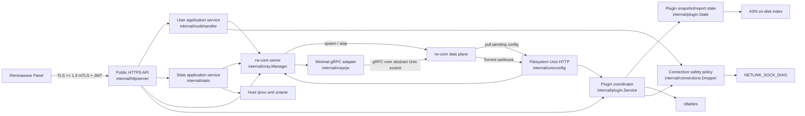
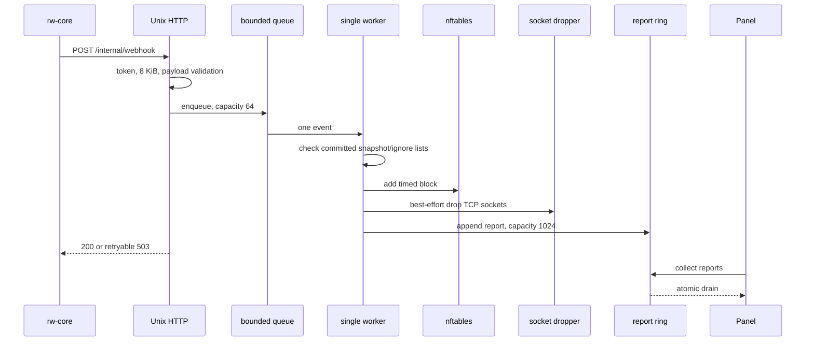
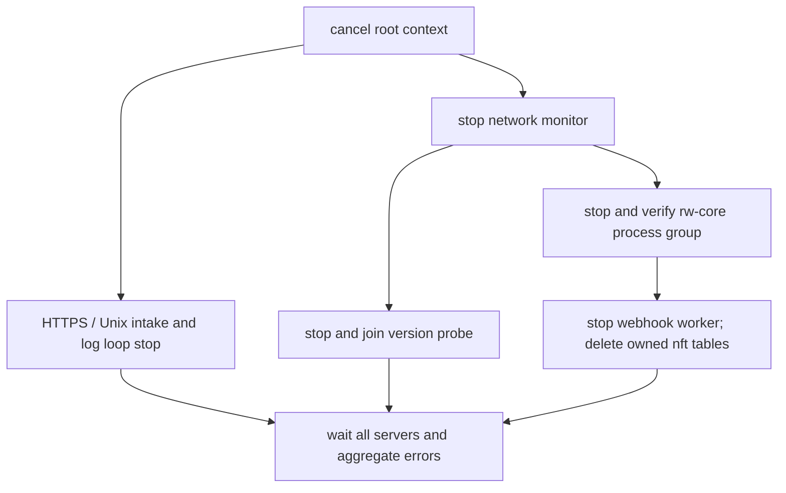

<!-- translation: locale=zh-CN; source=docs/architecture.md; source-sha256=55cbca863d4264b8ef599f48c671f902706ba6c694bc1e6a0cf8620b34245c5f -->
# 架构与运行时设计

> 这是中文译文；涉及实现、配置和规则时，请以[英文原文](../../architecture.md)为准。

[返回文档首页](README.md) · [开发指南](development/README.md)

本文面向第一次接触 Remnanode Lite 的维护者，描述当前代码真实采用的边界、运行流程、状态所有权和资源约束。它回答的是“系统如何工作、修改代码时应守住什么”，而不是部署参数或某个版本的发布清单。

部署方式见 [Docker Compose 部署](deployment-docker.md)，外部 API 的逐路由契约见 [当前官方契约基线](development/contract-2.8.0.md)，资源实测见 [512 MiB 资源预算](development/resource-budget.md)。

## 1. 系统定位

Remnanode Lite 是 Remnawave Panel 与 rw-core 之间的轻量控制面。它本身不转发代理流量，主要负责：

- 接收 Panel 通过 mTLS 和 JWT 保护的 Node API 请求。
- 校验请求并把配置、用户和统计操作转换为 rw-core 能理解的进程或 gRPC 操作。
- 管理 rw-core 子进程、启动配置、就绪状态和退出清理。
- 将插件配置编译为 nftables 规则，并处理 Torrent webhook 与报告。
- 在允许时通过 Linux `NETLINK_SOCK_DIAG` 终止指定 TCP 连接。
- 在固定资源预算下提供有界的请求、队列、日志和并发行为。

项目要对齐的是官方 Node 对外可见的行为和协议契约，而不是复刻其 TypeScript 内部架构。项目版本、官方 Node 契约版本、集成验证使用的 Panel 版本和 rw-core 版本互不等同，分别由版本包、契约证据、发布文档和供应链固定项管理。

生产目标平台是 Linux `amd64` 和 `arm64`，目标整机规格为 `512 MiB RAM / 1 vCPU / 2 GB disk`。带非 Linux build tag 的占位实现只用于保证项目可编译、单元测试可运行，不代表这些平台具备完整生产能力。

## 2. 系统全景



控制流通常从 Panel 进入，数据流量则直接由 rw-core 在宿主网络中处理。nftables 与 socket destroy 是内核副作用，只有在 Linux 且具备 `CAP_NET_ADMIN` 时可用。

## 3. 包与依赖方向

组合根位于 [`cmd/remnanode-lite/main.go`](../../../cmd/remnanode-lite/main.go)。它创建具体组件并把小接口连接起来。运行时包之间没有全局 service locator，也没有插件式动态装载。

| 路径 | 主要职责 |
| --- | --- |
| `cmd/remnanode-lite` | 生产 CLI、依赖装配、daemon 启动与整体关闭 |
| `cmd/asn-builder` | 离线构建低内存 ASN 二进制索引 |
| `cmd/contract-probe` | 对官方和候选 Node 做受控黑盒契约比较 |
| `internal/config` | 有界配置读取、环境覆盖、默认值和 Secret 文件读取 |
| `internal/secret` | 解码 Panel `SECRET_KEY`，提取 CA、JWT 公钥和 Node 证书/私钥 |
| `internal/auth` | RS256 JWT 签名、`exp`/`nbf` 和可选身份 claim 校验 |
| `internal/httpserver` | 公网 TLS、路由注册、认证、容量控制、DTO 映射和响应编码 |
| `internal/nodeapi` | 官方请求 DTO、JSON 结构保护、Zod 兼容验证与错误模型 |
| `internal/nodehandler` | 用户增删、批量变更和连接清理的应用服务 |
| `internal/stats` | rw-core、插件和宿主统计的应用响应映射 |
| `internal/xray` | rw-core 聚合根：进程状态机、配置注入、版本、哈希、日志和 gRPC 门面 |
| `internal/xrayrpc` | 面向 rw-core 的最小 gRPC wire adapter |
| `internal/xrayrpc/wire` | Node 实际使用的最小 protobuf 消息；`wire.pb.go` 为生成文件 |
| `internal/unixconfig` | rw-core 专用的文件系统 Unix Socket HTTP 服务 |
| `internal/xraywebhook` | Torrent webhook 的严格、单文档 JSON 模型 |
| `internal/plugin` | 插件校验、plan/apply/commit、nftables 和有界 webhook worker |
| `internal/asn` | `ReadAt + binary search` 的只读 ASN 到 CIDR 索引 |
| `internal/connections` | 白名单和本机地址保护后的连接踢除策略 |
| `internal/netadmin` | Linux capability 检测与 `SOCK_DESTROY` 内核适配 |
| `internal/system` | Node.js 兼容的宿主信息和网络速率采样 |
| `internal/bodylimit` | 原始及解压后请求体上限、压缩解码器容量控制 |
| `internal/executil` | 带 context、输出上限和可靠收尾的外部命令执行器 |
| `internal/doctor` | 原生部署的配置、资产、capability 与工具自检 |
| `internal/version` | 项目发行版本与向 Panel 报告的契约版本 |
| `internal/contract` | 独立的官方契约证据模型，不参与 daemon 运行路径 |

核心依赖方向如下：

```text
cmd/remnanode-lite
  -> version
  -> httpserver -> nodeapi
                -> nodehandler -> connections -> netadmin
                               -> xrayrpc
                -> stats       -> system
                               -> xrayrpc
                -> plugin      -> connections / xraywebhook
                -> xray
  -> unixconfig
  -> xray       -> xrayrpc / executil / system / netadmin
  -> config     -> secret
```

`nodehandler`、`stats` 和 `plugin` 都遵循“接口由调用方定义”的原则，小接口分别由 `xray.Manager`、`plugin.State` 或 `connections.Dropper` 实现。这样既便于用测试替身隔离副作用，也避免 `xray` 与 `plugin` 形成循环依赖。

这并不是严格的纯领域分层：例如 `nodehandler` 的端口仍使用 `xrayrpc` 值类型，`stats` 会直接组装 `system` 数据，`httpserver` 也负责请求准入和跨组件生命周期协调。因此应以实际能力边界判断依赖关系，不要只看包名。

## 4. 启动流程

守护进程入口是 `runNode`。没有 CLI 参数时，`main` 会调用它。入口首先创建一个由 `SIGINT` 或 `SIGTERM` 取消的根 `context`，后续初始化和后台任务都继承这条取消链。启动顺序会先暴露配置和安全错误，再打开监听端口：

1. 解析运行配置。
   - `REMNANODE_ENV` 显式指定路径时优先。
   - 否则优先已有的 `/etc/remnanode-lite/node.env`，最后回退 `.env`。
   - 配置文件值先加载，已知且非空的进程环境变量再覆盖它们。
2. 创建公开 `/node` server 的不可变请求体预算；经过配置解析的 contract/core 版本值保留在 `Config`，不写回进程环境。
3. 应用 Go 内存软上限。显式 `GOMEMLIMIT` 优先于 `LOW_MEMORY=1` 的 `180 MiB` 默认值。
4. 检查 `CAP_NET_ADMIN`。缺失只记录降级警告，不阻止基础 Panel API 启动。
5. 解析 `SECRET_KEY` 中的 Node TLS 材料、客户端 CA 和 JWT 公钥，并构建 JWT validator。
6. 创建 `plugin.State` 并尝试打开 ASN 数据库。
   - ASN 文件缺失或无效时插件 `asList` 降级为空，daemon 继续启动。
7. 创建 `system.NetworkMonitor` 和共享的 `system.Collector`，并立即登记监控器清理。
8. 创建 `xray.Manager`。
   - 生成本进程唯一的 rw-core gRPC abstract socket 名称。
   - 注入冻结的 Node/core 版本、共享 Collector 与 Torrent 配置 provider。
   - 尝试探测 rw-core 版本；失败时保留 unknown，后续 health 调用可节流重试。
9. 创建 `connections.Dropper` 和 `plugin.Service`。
   - Plugin webhook 单 worker 在 Service 构造时启动。
   - nftables 初始化使用根 context；失败是受支持的降级模式，但启动取消会立即返回。
10. 创建 `stats.Service` 和 `nodehandler.Service`，再将装配好的依赖交给 `httpserver.New`。
11. 创建公网 HTTPS server 和文件系统 Unix HTTP server。公网 server 在此校验 Node 证书/私钥并构建客户端 CA pool。
12. 并行启动公网 HTTPS、内部 Unix HTTP 和日志轮转，等待根 context 取消或任一 server 异常退出。

`internal/system` 在包加载时既不创建默认监控器，也不启动 goroutine。组合根创建唯一的 `NetworkMonitor`，让 Xray 和 stats 共享同一个 `Collector`，并在退出时停止轮询。每个需要关闭的组件一经创建就登记清理，因此后续初始化失败也不会让先前启动的资源继续运行。

## 5. Panel 请求流程

### 5.1 公网请求链

公网 server 只暴露固定的 26 条 `/node/*` 路由。请求按以下顺序进入：

```text
TLS >= 1.3 mTLS handshake
  -> reject non-/node paths
  -> validate RS256 Bearer JWT
  -> require an exact known method + path
  -> attach 5 minute request deadline
  -> bulk route admission (1)
  -> Xray start admission (2)
  -> active handler admission (32, LOW_MEMORY 4)
  -> attach route-specific body limit
  -> decompress with bounded decoder capacity
  -> limit decoded/transcoded body again
  -> parse charset and exactly one JSON document
  -> DTO validation
  -> dispatcher
  -> application service / runtime coordinator
```

TLS 要求 1.3 或更高版本，并使用 Secret 中的 CA 验证客户端证书。Go 的 HTTP/2 自动协商已关闭。为保持与官方 Node 一致，无效 JWT、未知路径或错误方法会直接关闭连接，而不是返回常规的 401/404/405 响应。

请求分为四组：

- Xray：start、stop、healthcheck，共 3 条。
- Stats：用户在线、流量、系统和 IP 统计，共 10 条。
- Handler：用户热更新和连接踢除，共 8 条。
- Plugin：同步、报告收集和 nftables 操作，共 5 条。

权威注册表是 [`internal/httpserver/node_routes.go`](../../../internal/httpserver/node_routes.go)。新增或修改路由时，不要在其他文件维护第二份运行时注册表。

### 5.2 请求资源与 JSON 边界

逐路由 body 上限为：

| 类别 | 上限 | 典型路由 |
| --- | ---: | --- |
| small | `64 KiB` | 查询、stop、health、remove user |
| medium | `256 KiB` | add user、block/unblock IP |
| bulk | `16 MiB` | Xray start、批量用户、连接批量、plugin sync |

`BODY_LIMIT_MB` 是公开 `/node` HTTPS server 的额外上限，最终值取 server 配置和路由上限的较小者。因此当前公开 API 即使在普通模式也不会接受超过 `16 MiB` 的请求。`LOW_MEMORY=1` 时该 server 默认上限是 `16 MiB`，显式配置更大值会在启动时失败；内部 Unix webhook 不读取此变量，固定为 `8 KiB`。

支持 `gzip`、`deflate`、`br` 和 `zstd`。最多同时运行两个 decoder；zstd 使用单线程、low-memory 模式和有界 window。wire body、解压结果和 charset 转码结果都会再次受限，不能用压缩比绕过预算。

JSON DTO 边界具备以下行为：

- 只解析一个顶层对象或数组，拒绝尾随的第二份文档。
- 官方 Zod 对象中的未知字段按兼容语义忽略。
- 拒绝重复键、仅大小写不同但会映射到同一字段的键、超过 64 层的嵌套、超长键，以及超出预算的 token 或集合。
- 支持 UTF-8/BOM、UTF-16 LE/BE；不支持任意 `application/*+json`。
- 验证问题最多返回 64 条，并限制错误文本、字段路径和候选选项的大小。

6 条没有 DTO 的路由允许空请求体；如果调用者发送 `application/json` 请求体，内容仍须是单一合法对象或数组，不能笼统描述为“忽略任何请求体”。

### 5.3 响应与错误

- 正常结果统一使用 HTTP 200 和 `{ "response": ... }` envelope。
- DTO 验证通常返回 400，请求过大返回 413，不支持的 charset/encoding 返回 415。
- 等待 admission 或生命周期 lease 超时返回 503、`Retry-After: 1` 并关闭连接；客户端主动取消则直接终止处理。
- Stats 和查询类应用错误使用 `A010` 至 `A017`；未分类错误在日志中记录并映射为 `E000`。
- Xray start 的业务失败位于 HTTP 200 response 内的 `isStarted=false/error`。
- 用户批量操作的部分失败位于 HTTP 200 的 `success=false/error`，不是跨多个 gRPC 调用的数据库事务。
- Plugin 操作使用 `accepted` 表达协议结果；它不总是“宿主机所有可选副作用均成功”的同义词。

### 5.4 用户和统计数据流

`nodehandler.Service` 使用容量为 1、支持取消的串行闸门执行所有用户增删操作。每个顶层操作只从 Manager 取得一次进程租约，并用租约返回的 `context` 执行 inbound/IP 查询、Handler RPC、连接清理和本地用户哈希提交。该租约绑定具体的 `process epoch + abstract socket`，因此 `Start` 和 `Stop` 必须等本次变更完成后才能继续；已释放或属于其他 Manager 的令牌会被拒绝。

批量用户操作可能已有前序 RPC 成功，代码不会伪造回滚。它保证的是本地哈希不领先于 rw-core、返回第一个明确错误，并让 Panel 可以安全重试。

删除用户前会以 `reset=false` 获取其在线 IP；只有相关 inbound 删除成功后才执行连接踢除。连接层会规范化、去重并过滤白名单，同时拒绝本机、loopback、link-local、multicast、unspecified、scoped 和 IPv4 broadcast 地址。

`stats.Service` 是响应映射层，底层数据来自三处：

- rw-core Stats gRPC：流量、在线、IP 和 runtime stats。
- `plugin.Service`：待收集 Torrent report 数量。
- `internal/system`：`uname`、`/proc/meminfo`、`/proc/loadavg`、`/proc/uptime`、`/proc/cpuinfo` 和默认接口速率。

Manager 为每次 Handler/Stats 操作创建短生命周期 gRPC client，调用完成即关闭。普通 RPC 默认 5 秒，Ping 为 3 秒，接收消息上限为 `16 MiB`。全用户 IP 优先使用 rw-core 扩展 RPC；遇到 `Unimplemented` 后缓存 legacy 能力并用最多 8 个 worker 查询单用户 IP。

由 map 聚合的用户和 tag 统计结果没有稳定顺序保证，调用方不应依赖排序。

## 6. 两条 Unix 通道

代码中存在两条用途和安全边界不同的 Unix 通道，文档和日志中必须准确区分。

| 通道 | 默认标识 | 所有者与协议 | 用途 | 安全边界 |
| --- | --- | --- | --- | --- |
| 文件系统 Unix Socket | `/run/remnanode/internal.sock` | Node 提供 HTTP，rw-core 作为客户端 | 拉取 pending config；投递 Torrent webhook | 文件 mode `0600`、稳定文件检查、内部 token |
| Linux abstract Unix Socket | `@remnanode-xtls-<16hex>` | rw-core 提供 gRPC，Node 作为客户端 | Handler 与 Stats RPC、readiness Ping | 同一 network namespace、随机名称、无内部 TLS |

### 6.1 文件系统 Unix HTTP

[`internal/unixconfig/server.go`](../../../internal/unixconfig/server.go) 提供：

- `GET /internal/get-config`
- `POST /internal/webhook`

Server 拒绝替换 symlink、普通文件或仍在监听的 socket；只删除经过前后 identity 核对的 stale socket。目录使用非阻塞 `flock` 防止两个 Node 同时拥有同一路径，新 socket 设置为 `0600`。

连接上限为 8，活动 handler 上限为 4，webhook 最多使用其中 3 个槽，为 rw-core 拉取启动配置保留容量。header 上限 `8 KiB`，request deadline 30 秒，webhook body 上限 `8 KiB`。

内部认证优先使用 `X-Internal-Token`；query token 仅为兼容旧路径。请求未提供 token 时依赖 owner-only socket 权限。未配置 `INTERNAL_REST_TOKEN` 时，Node 每次启动生成 48 个随机字节的 URL-safe token。

### 6.2 Abstract gRPC

Manager 构造时生成随机的抽象 socket 前缀，每个 rw-core 进程再追加自己的 epoch，并把最终名称注入 tunnel inbound。这样，旧进程延迟到达的 gRPC 客户端不会误连到替换后的 core。`internal/xrayrpc` 通过 `grpc.ClientConnInterface.Invoke` 调用明确的方法路径，不依赖完整的 Xray Go SDK。

这里使用 insecure gRPC transport，因为它不是公网 TCP 边界；但 abstract socket 并非“只有当前进程可以访问”，它位于同一 network namespace。随机名称降低发现概率，容器或宿主的 namespace 隔离仍是安全模型的一部分。

[`internal/xrayrpc/wire/wire.proto`](../../../internal/xrayrpc/wire/wire.proto) 只声明 Node 真正使用的字段，字段号和 wire type 必须与 rw-core 一致。`wire.pb.go` 是生成文件，不应手工编辑；method path、TypedMessage type name 和黄金 wire bytes 由 `internal/xrayrpc/wire_golden_test.go` 固定。

## 7. Xray start 流程

### 7.1 状态机与所有权

`xray.Manager` 是 rw-core 的唯一进程所有者：

```mermaid
stateDiagram-v2
    [*] --> stopped
    stopped --> starting: accepted start
    running --> starting: restart required
    starting --> running: gRPC ready and process alive
    starting --> stopped: failure and cleanup complete
    starting --> stopping: stop cancels start
    running --> stopping: stop
    running --> stopped: natural exit and cleanup complete
    stopping --> stopped: process group cleanup verified
    stopping --> stopping: cleanup failed; later stop retries
```



核心同步字段：

- `Manager.mu` 保护状态、operation/process epoch、process、pending config、哈希、inbound tags 和版本。
- `Manager.lifecycleMu` 表示长时间持有的进程生命周期所有权，一次只有一个 Start/Stop owner。
- `processState.mutationGate` 使已接受的用户/stats mutation 绑定当前进程，生命周期 writer 在替换或终止它前等待。
- `processState.finalizeMu` 保证 signal、kill、Wait 与进程组清理不会并行重复。
- `operationEpoch` 识别当前 Start/Stop 所有者；`process.epoch + socket` 识别真实 rw-core 实例，两者不混用。

HTTP 层还有一层 `xrayLifecycleGate`：

- start 使用共享 lease，最多两个请求进入，让第二个请求可得到官方兼容的 `Request already in progress`。
- stop、plugin sync/recreate、用户 mutation 和会 reset 的 stats 使用独占 lease。
- 已等待的独占请求会阻止后续 start 插队。

这两层职责不同：HTTP gate 协调跨组件操作，Manager 锁维护真实进程所有权。

### 7.2 详细启动链

```mermaid
sequenceDiagram
    participant P as Panel
    participant H as httpserver
    participant M as xray.Manager
    participant U as Unix HTTP
    participant C as rw-core
    participant G as abstract gRPC

    P->>H: POST /node/xray/start
    H->>H: auth, limits, DTO validation
    H->>M: Start(config, hashes)
    M->>M: compare current hashes
    alt running and unchanged
        M-->>H: isStarted=true, no process replacement
    else restart required
        M->>M: inject API/stats/policy/plugin config
        M->>M: serialize bounded pending JSON
        M->>C: stop prior owned process group
        M->>C: spawn rw-core with http+unix config URL
        C->>U: GET /internal/get-config
        U->>M: CurrentConfigJSON
        M-->>C: pending JSON
        M->>G: Ping until ready
        G-->>M: ready
        M->>M: commit running/hash/version; release full JSON
        M-->>H: isStarted=true
    end
    H-->>P: HTTP 200 response envelope
```

实际步骤：

1. 拒绝正在 starting/stopping 的并发请求，或被前次失败清理保留的 unclean process。
2. 若 core 已 running、不是 force restart 且哈希检查开启，先实时 Ping gRPC，再比较 base hash、inbound 集合和用户 HashedSet；一致则复用当前进程。
3. 就地接管请求中的 `xrayConfig`，避免大配置完整 clone。
4. 覆盖/注入 stats、API、policy、abstract tunnel inbound 和 API routing rule。
5. 根据已提交且有效的 Plugin snapshot 注入 Torrent blackhole outbound、routing rule 和 webhook。
6. 构建紧凑 hash state，并把最终配置序列化为最多 `20 MiB`、128 层的 canonical JSON。
7. 停止并确认上一进程已清理。
8. 把 JSON 放入 `pendingConfigJSON`，启动 rw-core：

   ```text
   rw-core -config http+unix://<filesystem-socket>/internal/get-config -format json
   ```

9. 等待 abstract gRPC ready。普通模式默认 20 秒，`LOW_MEMORY=1` 默认 90 秒，每 2 秒探测。
10. 确认当前 operation 仍拥有该 process epoch 且进程未退出，探测 core 版本，原子发布 running、hash state 和 version。
11. 立即释放完整 JSON，只保留紧凑哈希与 inbound tag。

`CurrentConfigJSON()` 不是运行期 dump-config。它只在启动阶段返回 pending JSON；rw-core ready 后返回 `{}`。Node 重启后也不会从磁盘恢复旧 Panel 配置，而是等待 Panel 重新下发 start。

`Health()` 同样不是实时 gRPC 探活：`IsAlive` 表示 Node 进程响应，`XrayInternalStatusCached` 来自本地生命周期缓存。需要判断 rw-core 是否真实 ready 时，应看 start/readiness 路径，而不是扩展 health 的现有契约语义。

### 7.3 子进程与 Secret 边界

Linux 上 rw-core 被放入独立 process group，并设置 `Pdeathsig=SIGKILL`。停止时先对整个组发 SIGINT，默认等待 5 秒，再发 SIGKILL 并等待 5 秒。实现暂不回收已退出的 leader PID，先扫描 `/proc` 确认没有存活的非 leader 后代，再执行唯一一次 `Wait`，避免 PID 重用导致误伤其他进程组。

rw-core 子进程环境由 `rwCoreEnvironment` 显式整理：

- 移除 `SECRET_KEY`、`SECRET_KEY_FILE`、`INTERNAL_REST_TOKEN` 和 `REMNANODE_ENV`。
- 移除调用方可能预置的 asset path 和 rw-core 内部 token，再写入本次受控值。
- 保留其它非受管环境变量，并用本次受控值覆盖 `XRAY_LOCATION_ASSET` 和 `RNL_INTERNAL_REST_TOKEN`。

因此 Panel TLS 私钥、CA 和 JWT 公钥只需留在 Go Node 进程，不会作为环境变量继续传给 rw-core。内部 token 是特意传递给 rw-core 的例外，用于文件系统 Unix HTTP/webhook 协作。

`Pdeathsig` 只直接作用于 leader。Node 或外层 supervisor 被强杀时不保证所有后代一定自动回收；恢复策略仍是重启服务、主机或重建容器。

## 8. Plugin sync 与 webhook 流程

### 8.1 状态与 plan/apply/commit

`plugin.Service` 负责副作用事务编排，`plugin.State` 负责发布只读状态。`pluginSnapshot` 发布后不可变，只保存：

- 原始 source hash 和官方 object-hash 兼容 config hash。
- Plugin UUID/name。
- firewall readiness。
- 连接踢除白名单 matcher。
- Torrent 派生设置。
- 静态 firewall plan。

完整插件 JSON 不会长期保留。一次 sync 的主要步骤是：

1. 获取容量为 1、支持取消的 Plugin operation lease。
2. 对相同 source hash 和相同 firewall readiness 走快速路径，只更新身份。
3. 否则先校验 JSON、schema、集合和资源预算，再产生任何副作用。
4. 展开 shared IP list 和 ASN list，生成不可变 plan。
5. 与现有行为等价时只发布新 snapshot，保留动态 Torrent block。
6. 行为变化时按所需顺序协调 nftables 与 Xray。
7. 两侧成功后才提交 snapshot；可回滚失败会重放上一份静态 firewall plan。

普通启用/更新通常先应用 firewall，再协调 Xray。关闭 Torrent、清理或破坏性 reset 先协调或停止 Xray，再 reset firewall，避免 running core 暂时失去过滤。

Torrent 启停或 `includeRuleTags` 变化可能调用 `StopIfOnline`。它只停止 rw-core，不自动重新启动；后续 start 由 Panel 的正常同步流程触发。无 include tags 的 Torrent 关闭可以通过 Handler gRPC 热删除专用 outbound。

非法插件配置不会简单保留旧配置：Service 会尝试停止 Xray、清理 Plugin snapshot 并 reset firewall，同时保留尚未被 Panel collect 的报告。

缺少 `CAP_NET_ADMIN` 或 nft 初始化失败时，合法配置仍可按官方语义被接受为 degraded snapshot，但 nft 过滤和有效 Torrent blocker 保持禁用。文档不得把 `accepted=true` 写成“所有宿主机可选功能都已生效”。

### 8.2 nftables 所有权

Linux backend 管理固定表：

- IPv4：`remnanode`
- IPv6：`remnanode6`

每族包含 Torrent、ingress、egress IP set 和 egress port set。input/forward 按 source IP 过滤，output 按 destination IP 或 TCP/UDP destination port 过滤，chain policy 保持 accept。

- `Apply` 只替换静态 sets，保留动态 Torrent elements。
- `Reset` 重建双栈表并重放静态 plan，会清空动态 Torrent elements。
- `BlockIPs` 使用双栈批量事务。
- `UnblockIPs` 按地址和 set 分开执行，避免一个不存在的元素回滚其他删除。
- `RecreateTables` 使用 Reset，因此不保留动态 timed blocks，只重放已提交静态计划。
- `Close` 只删除当前进程认为自己 owned 的表。

表名不是实例唯一名称。同一 network namespace 只支持一个 Remnanode Lite 实例；在 host network 下运行多个实例会竞争同一组 nftables 表。

### 8.3 Torrent webhook



Webhook 必须提供 email 和 source。IP 会规范化，并拒绝 scoped、unspecified、loopback、multicast、link-local 和 IPv4 broadcast；ignored user/IP/CIDR 不产生封禁。

格式错误的 webhook 会记录一条长度受限的诊断信息，并返回 200，以保持当前兼容语义。只有请求未被有界队列接纳时，服务才返回可重试的 503。

队列满时请求会在其 30 秒 context 内等待容量，而不是无界增长或静默丢弃。服务关闭、请求取消或容量始终不可用时返回 503。单 worker 获取与 sync/block/unblock 相同的 operation gate，确保 Plugin 副作用串行。

报告使用最多 1024 条的时间顺序环形队列；满时覆盖最旧记录并累计 dropped count，Panel collect 时原子 drain。nft block 成功后报告记为 blocked；后续 socket drop 是 best effort，其失败不会反向修改 `accepted` 或 blocked 状态。

连接踢除只针对 connected TCP socket，不支持 UDP、LISTEN 或 TIME_WAIT。`netadmin` 对 IPv6 和 IPv4 各做一次流式 socket dump，逐条验证 `SOCK_DESTROY` ACK，`ENOENT` 视为幂等成功。

## 9. 关闭流程

根 context 因信号或 server 异常取消后，所有应用清理共享一个 25 秒 deadline，不为每个组件重新计时。



具体语义：

- Network monitor 先收到停止信号。
- Manager 的后台版本恢复可与业务清理并行关闭。
- 业务顺序固定为 `stop rw-core -> close Plugin/nft`，在 core 确认停止前保持过滤规则。
- rw-core 或 Plugin 快速返回瞬时清理错误时，等待 100 ms 后在同一 deadline 内重试一次。
- HTTPS 尝试 graceful shutdown，失败后 force close。
- Unix server 在根 context 取消后使用自身最多 5 秒的 shutdown；Plugin cleanup 默认最多使用剩余预算中的 15 秒。
- WaitGroup 等待 HTTPS、Unix server 和日志轮转退出，所有错误通过 `errors.Join` 聚合。

外层 systemd/Compose 的 stop grace 必须大于应用 25 秒预算，给 runtime 强杀和容器收尾留出余量。应用返回并不承诺掉电、`SIGKILL` 或 supervisor 自身崩溃时的持久事务恢复。

## 10. 状态所有权与持久化

| 状态 | 唯一所有者 | 同步方式 | 生命周期 |
| --- | --- | --- | --- |
| rw-core process/state/epochs | `xray.Manager` | `mu` + `lifecycleMu` + process mutation gate | Node 进程内 |
| pending Xray JSON | `xray.Manager` | `mu` | 仅 start 到 gRPC ready |
| inbound tags/user hash | `xray.Manager` | `mu` + process lease identity | 当前 rw-core process epoch |
| rw-core version与 stats capability | `xray.Manager` | mutex / atomic | Node 进程内 |
| committed Plugin snapshot | `plugin.State` | RWMutex，发布后不可变 | Node 进程内 |
| Torrent report ring | `plugin.State` | RWMutex | Node 进程内，collect 后清空 |
| Plugin mutation/worker lifecycle | `plugin.Service` | channel gate、atomic fence、stop channels | Node 进程内 |
| 用户 mutation serialization | `nodehandler.Service` | capacity-1 channel gate | Node 进程内 |
| host network sample | `system.NetworkMonitor` | RWMutex + 3 秒 poller | Node 进程内 |
| ASN prefix data | `asn.DB` | read-only file + `ReadAt` | 磁盘只读资产 |
| nftables rules | Linux kernel | Plugin transaction + backend mutex | network namespace |
| rw-core logs | capped writers / periodic rotation | writer mutex / rotation mutex | `LOG_DIR`，容器通常为 tmpfs |

Node 不持久化 Panel 下发的完整 Xray 配置、Plugin snapshot、用户哈希或 Torrent report。进程重启后的正确恢复来源是 Panel 重新同步，而不是读取本地旧状态。

ASN 数据库使用自定义的 `RWASNDB\x01` 小端格式。只有命中某个 ASN 时才读取对应的前缀数据，不使用 mmap，也不会把整个数据库载入内存。启动时只检查文件头和 magic；文件其他位置的损坏通常表现为空查询结果，因此这不等于启动时完成全库校验。

## 11. 并发与资源边界

所有高风险资源必须有显式上限。当前主要预算如下：

| 资源 | 普通模式 | `LOW_MEMORY=1` / 固定值 |
| --- | ---: | ---: |
| Public TCP connections | 128 | 16 |
| Active HTTP handlers | 32 | 4 |
| Non-start bulk handlers | 1 | 1 |
| Concurrent admitted starts | 2 | 2 |
| Compression decoders | 2 | 2 |
| Public route body | 最大 16 MiB | 最大 16 MiB |
| Prepared rw-core JSON | 20 MiB / 128 层 | 同左 |
| gRPC receive message | 16 MiB | 同左 |
| Unix connections / handlers | 8 / 4 | 同左 |
| Unix webhook handlers | 最多 3 | 同左 |
| Plugin config | 2 MiB | 同左 |
| Plugin mutation | 1 | 同左 |
| Webhook queue / workers | 64 / 1 | 同左 |
| Torrent reports | 1024 | 同左 |
| Resolved Plugin IP items | 32768 | 同左 |
| Dynamic nft elements per family | 16384 | 同左 |
| NFT block / unblock batch | 1024 / 128 | 同左 |
| Legacy IP lookup workers | 8 | 同左 |
| 每条 rw-core/OpenRC 日志阈值 | 4 MiB + 一个 `.1` | 同左 |
| Go soft memory limit | 由 runtime 决定 | 默认 180 MiB |

Public handler 的“优先容量分类”会为 mutation 保留至少一个总 handler 槽。代码中的 `nodeRouteIsReadOnly` 是 admission 分类名，其中部分 stats DTO 仍允许 `reset=true`；不要把它解释为严格的无副作用安全属性。

跨组件锁序是：

```text
HTTP Xray lifecycle lease -> Plugin operation gate / nodehandler mutation gate -> xray process lease -> Manager state
```

在 HTTP 边界，start 使用共享租约；stop、Plugin 变更、用户变更和带 reset 的 stats 操作使用独占租约。用户服务还会持有一个绑定当前 rw-core `process epoch + abstract socket` 的进程租约，并在租约内完成 RPC、IP 查询、连接清理和本地哈希提交。`Start` 和 `Stop` 必须等它释放后，才能替换或终止进程。

`operationEpoch` 只标识生命周期操作的所有权，不代表具体进程。未来新增绕过 HTTP 的内部变更入口时，必须复用 Manager 的进程租约，不能直接组合多个 RPC 并引入新的锁顺序。

## 12. 安全边界

### 12.1 外部信任边界

- 公网 API 默认可能绑定所有地址；端口暴露范围由部署防火墙控制。
- mTLS 证明客户端证书由 Panel Secret 中 CA 签发。
- JWT 只允许 RS256，校验签名，并在 claim 存在时校验 `exp`/`nbf`。
- 当前 daemon 使用空的 issuer/audience/subject expectations，不应在文档中宣称已强制这些 claim。
- 无效认证和未知路由直接断开，降低接口枚举面。

### 12.2 Secret 与文件边界

- `SECRET_KEY` 最大编码长度为 256 KiB，兼容标准/URL-safe base64 的 padded/raw 形式。
- Secret JSON 必须是单一 object，拒绝重复字段，要求 CA、JWT 公钥、Node 证书和私钥。
- `SECRET_KEY` 环境值优先于 `SECRET_KEY_FILE`。
- 配置和 Secret 文件必须是稳定的普通非 symlink 文件；Linux/macOS 使用 `O_NOFOLLOW|O_NONBLOCK|O_CLOEXEC`，同一 fd 在读取前后核对 identity/size/mtime。
- rw-core 环境按 7.3 节过滤已知 Node Secret，并覆盖受控内部 token 与 asset path；其它非受管环境仍继承。

### 12.3 内核能力边界

`CAP_NET_ADMIN` 用于 nftables 和 socket destroy。缺失时：

- Node API、mTLS、Xray 生命周期和不依赖 nft 的能力仍可运行。
- Plugin firewall 进入 degraded/unavailable 状态。
- 连接踢除返回失败或被上层按契约映射。

Node 只拥有固定的项目表和自己创建的 rw-core 进程组，不应修改宿主机的通用 Xray 路径或其他 nftables 表。

底层 socket destroy 按本地或远端 IP 匹配同一 network namespace 中已连接的 TCP socket，不按 PID 判断归属。因此在共享宿主上，它可能关闭其他进程的连接。Panel 业务路径会先过滤本机和特殊地址，但管理命令 `remnanode-lite kill-sockets` 不经过这层保护。生产环境应使用专用的节点网络环境，也不要对宿主本机 IP 执行该命令。低端口监听是否需要 `CAP_NET_BIND_SERVICE` 取决于实际部署端口。

## 13. 修改代码时从哪里开始

### 新增或修改公开路由

1. 更新 `internal/httpserver/node_routes.go` 的唯一注册表和 body/admission 分类。
2. 在 `internal/nodeapi` 定义 DTO、结构 schema 和验证语义。
3. 在 `httpserver` 只做 decode、映射和 response adapter，不把 HTTP 类型带入应用服务。
4. 在 `nodehandler`、`stats`、`plugin` 或 `xray` 实现业务行为。
5. 同步 `internal/contract` 的路由、schema、合法样例和副作用；用 `contract-source-check -write` 从固定官方 Git object 重建 source manifest，并评审内容摘要与机器提取路由的 diff。
6. 增加“非法输入不触发副作用”以及真实 dispatcher response schema 测试。

### 修改 Xray 生命周期

- 保持 `Manager` 是唯一进程 owner。
- 任何异步生命周期结果提交前检查 operation epoch、process identity 和 state。
- 只有 gRPC ready 且进程仍存活时发布 running。
- 启动失败必须回收已 spawn 的进程，并明确 stopped 或可重试的 stopping。
- 不在 ready 后保留第二份完整配置。
- 覆盖并发 start、start/stop 交错、取消、超时、自然退出和清理重试测试。

### 修改 Plugin 或 nftables

- 遵循 `validate/build plan -> apply side effects -> commit immutable snapshot`。
- 在任何副作用前完成 collection 和 expansion 预算校验。
- 说明使用 Apply 还是破坏性的 Reset，以及动态 Torrent elements 是否保留。
- 保持 core 停止与 firewall 删除的安全顺序。
- 同步单元测试和 Linux network namespace 集成测试。

### 修改 gRPC wire

- 以 rw-core 实际字段号和 method path 为依据修改 `wire.proto` 或显式常量。
- 运行 `scripts/generate-protobuf.sh`，使用固定的 `protoc 35.1` 与 `protoc-gen-go v1.36.11` 重新生成 `wire.pb.go`，不要手工编辑生成文件。
- 更新 wire golden、Handler/Stats tests 和真实 rw-core integration test。
- 提交前运行 `scripts/generate-protobuf.sh --check`，逐字节确认生成文件与 schema 一致。

### 修改 Linux 专用能力

- Linux 实现在带 build tag 文件中完成。
- 同时提供清晰失败或降级的非 Linux stub，保证包可构建。
- 不把 stub 存在描述为该平台生产支持。
- 涉及 nft/netlink/process group 时使用隔离 namespace 或真实进程测试。

## 14. 测试与真相源

架构约束主要由可执行测试而不是文档自证：

- 常规：`go test ./...`
- 并发：`go test -race ./...`
- 静态：`go vet ./...`、`gofmt`、`go mod tidy -diff`
- 官方源码证据：`go run ./cmd/contract-source-check -source <official-git-repository>`
- nftables 集成：`REMNANODE_NFT_INTEGRATION=1`
- socket destroy 集成：`REMNANODE_SOCKET_KILL_INTEGRATION=1`
- 低内存真实 core：`scripts/test-low-memory.sh`

`internal/contract` 是根据官方 Zod 契约人工维护的可执行子集，不是从 TypeScript schema 自动生成的。source manifest 保存固定提交中每个证据 blob 的 SHA-256。

提取器会禁用 Git replace refs，并独立读取官方 `REST_API`、全局 prefix 和 controller decorator。它还会对照 Git tree 核验真实 bootstrap、静态 import、严格的 module metadata、controller 与 decorator 归属、注册可达性和内部 prefix exclusion。遇到不支持的 TypeScript 语法时，检查会直接失败。这样可以避免手工路由表或宽松的 token 扫描自我验证，但它仍不是完整的 Zod 翻译器。需要对两个运行实例做受控黑盒比较时，使用 `cmd/contract-probe`。

查阅或修改行为时按以下文件作为真相源：

| 问题 | 真相源 |
| --- | --- |
| 实际公开 method/path | `internal/httpserver/node_routes.go` |
| 官方兼容目标与响应 schema | `internal/contract` + source manifest + 固定官方 Git object |
| 请求 DTO/验证错误 | `internal/nodeapi` |
| 配置键、默认值、优先级 | `internal/config/config.go` |
| Xray 状态机与进程语义 | `internal/xray/lifecycle.go`、`process_linux.go` |
| Plugin 事务和状态 | `internal/plugin/service.go`、`state.go` |
| 资源硬上限 | `internal/bodylimit`、`internal/plugin/resource_limits.go`、相关常量与测试 |
| protobuf wire | `internal/xrayrpc/wire/wire.proto` + wire golden tests |
| 项目版本和契约版本 | `internal/version`、`internal/version/contract.version` |
| 容器运行边界 | `compose.yaml`、`Dockerfile` |

文档用于解释这些约束及其理由。当文档与可执行真相源不一致时，应先核对代码和测试，再在同一变更中修正文档，避免把历史里程碑或一次验收数据当成永久架构事实。
